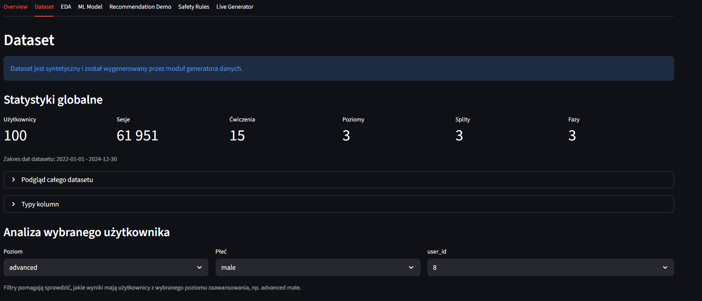
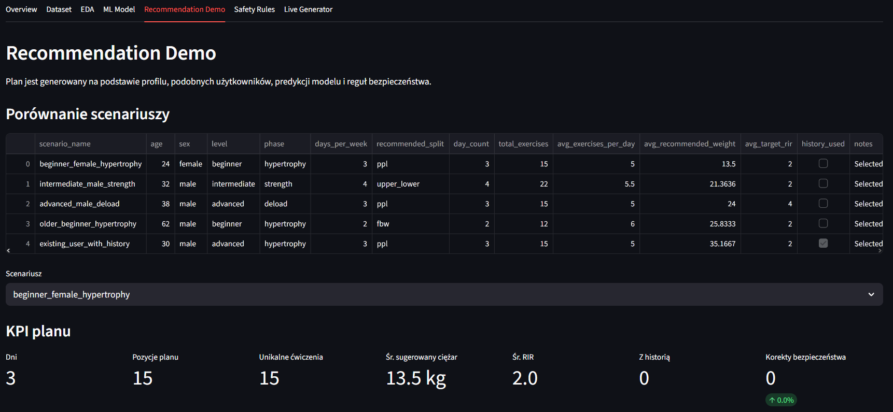
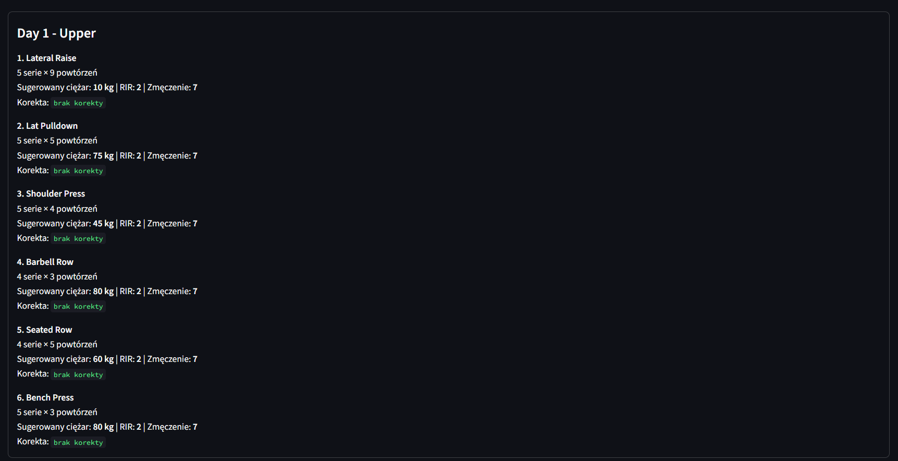
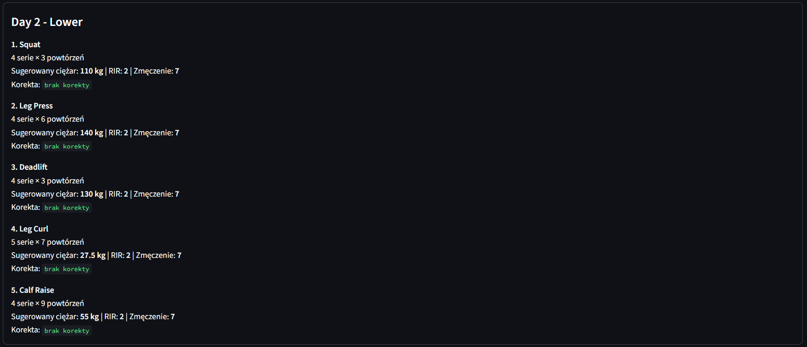

# Training AI Project

End-to-end Data Science project for synthetic strength-training data generation,
exploratory analysis, weight prediction, and demonstrational workout-plan
recommendations.


## Table of Contents

- [Project Goal](#project-goal)
- [Project Scope](#project-scope)
- [Project Status](#project-status)
- [Preview](#preview)
- [Tech Stack](#tech-stack)
- [What It Does](#what-it-does)
- [Example Insights](#example-insights)
- [Features](#features)
- [Dashboard Sections](#dashboard-sections)
- [Workflow](#workflow)
- [Architecture](#architecture)
- [Data](#data)
- [Modeling Results](#modeling-results)
- [Installation](#installation)
- [Running The Project](#running-the-project)
- [Reports And Outputs](#reports-and-outputs)
- [Tests](#tests)
- [Design Principles](#design-principles)
- [Limitations & Future Work](#limitations--future-work)
- [Screenshots](#screenshots)
- [Authors](#authors)

## Project Goal

Training AI Project explores how machine learning can support strength-training
analysis and workout-plan recommendations without using real personal training
logs.

The project builds a complete analytical pipeline:

- generate realistic synthetic set-level gym data,
- inspect training patterns through EDA,
- engineer historical features for a regression problem,
- train and compare weight-prediction models,
- combine the selected model with rule-based recommendation logic,
- present the dataset, model behavior, and generated plans in Streamlit.

The recommendation layer is a demonstrational decision-support prototype. It is
not a medical tool, a production coaching system, or a replacement for a trainer,
physiotherapist, or clinical advice.

## Project Scope

The repository contains the full project flow, including:

- synthetic workout dataset generator,
- canonical CSV dataset used by the analysis and dashboard,
- exploratory analysis scripts and charts,
- feature engineering for historical workout context,
- regression model comparison and saved best pipeline,
- hybrid recommendation engine,
- end-to-end demo scenarios,
- Streamlit dashboard,
- final report and presentation materials.

## Project Status

The project is a functional portfolio/demo project. Core parts are implemented:
data generation, EDA, model training, recommendation scenarios, local Streamlit
dashboard, and final report.

Current version is intended for local review. The trained model artifact
`models/best_weight_prediction_model.joblib` is generated locally and ignored by
Git because of its size. If it is missing after a fresh clone, run Stage 2 before
using the live recommendation generator.

## Preview


## Tech Stack

- **Python 3.10+**
- **Pandas** and **NumPy** for data processing
- **scikit-learn** for regression pipelines and model comparison
- **joblib** for model serialization
- **Streamlit** for the dashboard UI
- **matplotlib** and **seaborn** for charts
- **CSV** as the main data and artifact format
- **Markdown / PDF / DOCX** for report outputs

## What It Does

Training AI Project simulates multiple years of strength-training history for
synthetic users, analyzes the resulting dataset, trains a model to predict
working weight, and uses that model inside a hybrid workout-plan recommender.

The system works at set level. Each row describes one performed set with
exercise, repetitions, weight, fatigue, RIR, training level, split, phase, and
user metadata. These rows are then aggregated and transformed into features that
describe recent training history for a given user and exercise.

The final recommendation flow combines:

- model-predicted weights,
- user history when available,
- similar-user fallback data,
- strength calibration anchors,
- split and exercise-selection rules,
- safety constraints for fatigue, RIR, deload phases, and older users.

## Example Insights

The project can answer questions such as:

- What do synthetic training patterns look like across levels, splits, phases,
  and sex?
- Which exercises dominate the generated dataset?
- How do volume, RIR, fatigue, and working weight vary over time?
- How well can previous training history predict the next working weight?
- Which model performs best for this regression task?
- Which features matter most for predicted training weight?
- How do recommendation scenarios change for beginner, intermediate, advanced,
  deload, and older-user profiles?
- When do safety rules reduce or cap the recommended load?

## Features

### Synthetic Data Generation

- Configurable number of users and simulated years.
- Set-level workout history with users, sessions, exercises, sets, reps, weight,
  fatigue, RIR, level, split, phase, and sex.
- Training behavior shaped by experience level, training split, phase, fatigue,
  progression, and random daily variation.
- Command-line entry point for regenerating the canonical dataset.

### Exploratory Data Analysis

- Dataset validation, missing-value checks, and duplicate checks.
- Distribution charts for weight, reps, RIR, fatigue, level, split, phase, and
  sex.
- Exercise frequency and session-level summaries.
- Daily volume trends and correlation analysis.
- Derived analytical features such as volume and Epley estimated 1RM.

### Predictive Modeling

- Historical features using previous set values and rolling averages.
- Time-based train/test split to better reflect future prediction.
- Comparison of Random Forest, Ridge Regression, HistGradientBoosting, and a
  naive previous-weight baseline.
- Model evaluation by MAE, RMSE, R2, and percentage of predictions within 2.5 kg
  and 5 kg.
- Saved best model pipeline in `models/best_weight_prediction_model.joblib`.

### Hybrid Recommendation Engine

- Split choice based on requested training days.
- Exercise selection by push, pull, legs, upper/lower, or full-body structure.
- Weight recommendation from strength calibration, user history, model
  prediction, or fallback medians.
- Practical rounding to common gym increments.
- Safety adjustments for high fatigue, low RIR, deload phase, progression caps,
  and age-sensitive recommendations.

### Streamlit Dashboard

- Dataset overview and user-level analysis.
- EDA visualizations and training distributions.
- ML model metrics, comparisons, and feature importance.
- Static recommendation-demo scenarios.
- Live generator for local recommendations when the trained model is available.

## Dashboard Sections

- `Overview` - project summary, dataset shape, and high-level context.
- `Dataset & User Analysis` - synthetic users, sessions, exercises, and training
  distributions.
- `EDA` - exploratory charts and correlations.
- `ML Model` - model comparison, evaluation metrics, and feature importance.
- `Recommendation Demo` - prepared weekly plans for selected scenarios.
- `Live Generator` - interactive local plan generation using the trained model.

## Workflow

```text
generator/
  -> data/FINAL_ENGINE_V4.csv
  -> scripts/01_eda.py
  -> scripts/02_modeling_and_recommendation.py
  -> models/best_weight_prediction_model.joblib
  -> scripts/03_system_demo.py
  -> app/demo_assets/
  -> app/streamlit_app.py
```

1. `generator/main.py` creates the synthetic set-level dataset.
2. `scripts/01_eda.py` validates and explores the dataset.
3. `scripts/02_modeling_and_recommendation.py` engineers features, trains
   models, compares results, and saves the best model.
4. `scripts/03_system_demo.py` loads the trained model and generates complete
   weekly recommendation scenarios.
5. `app/streamlit_app.py` presents the dataset, analysis, model outputs, demo
   plans, and live generator.

## Architecture

The repository is split into focused layers:

```text
TrainingAIProject/
|-- app/
|   |-- demo_assets/       # small CSV scenarios used by the dashboard
|   `-- streamlit_app.py   # Streamlit UI
|-- data/
|   `-- FINAL_ENGINE_V4.csv
|-- generator/
|   |-- config.py          # simulation configuration
|   |-- generator.py       # dataset orchestration
|   |-- main.py            # CLI entry point
|   |-- models.py          # synthetic user/training domain objects
|   `-- session.py         # session and set simulation
|-- models/
|   `-- *.joblib           # generated locally, ignored by Git
|-- outputs/
|   |-- eda_outputs/       # generated locally
|   |-- stage2_outputs/    # generated locally
|   `-- stage3_outputs/    # generated locally
|-- report/
|   |-- final_report.pdf
|   |-- final_report.docx
|   `-- images/
|-- scripts/
|   |-- 01_eda.py
|   |-- 02_modeling_and_recommendation.py
|   `-- 03_system_demo.py
|-- src/
|   `-- recommendation_engine.py
|-- presentation/
|-- README.md
`-- requirements.txt
```

Core rule: generation, modeling, recommendation logic, and dashboard rendering
are separated. The reusable recommendation code lives in
`src/recommendation_engine.py`, while the Streamlit app imports it for
interactive use.

## Data

Main dataset:

```text
data/FINAL_ENGINE_V4.csv
```

The data is synthetic. It is generated by the local simulation module and does
not contain real workout logs or personal user data.

Current dataset snapshot:

| Property | Value |
| --- | ---: |
| Rows | 1,215,602 |
| Columns | 13 |
| Synthetic users | 100 |
| Sessions | 61,951 |
| Exercises | 15 |
| Date range | 2022-01-01 to 2024-12-30 |

Dataset columns:

| Column | Meaning |
| --- | --- |
| `user_id` | Synthetic user identifier. |
| `session_id` | Training session identifier. |
| `date` | Workout date. |
| `exercise` | Exercise name. |
| `set_number` | Set number within the exercise. |
| `reps` | Number of repetitions. |
| `weight` | Working weight in kilograms. |
| `fatigue` | Simulated fatigue level. |
| `rir` | Reps in reserve. |
| `level` | Training level: `beginner`, `intermediate`, or `advanced`. |
| `split` | Training split: `fbw`, `ppl`, or `upper_lower`. |
| `phase` | Training phase: `hypertrophy`, `strength`, or `deload`. |
| `sex` | Synthetic user sex: `female` or `male`. |

Small dashboard-ready demo assets are stored in `app/demo_assets/`:

- `scenario_comparison.csv`
- `plan_beginner_female_hypertrophy.csv`
- `plan_intermediate_male_strength.csv`
- `plan_advanced_male_deload.csv`
- `plan_older_beginner_hypertrophy.csv`
- `plan_existing_user_with_history.csv`

## Modeling Results

Stage 2 compares several approaches for predicting working weight.

| Model | MAE | RMSE | R2 | Within 5 kg |
| --- | ---: | ---: | ---: | ---: |
| Random Forest | 3.8604 | 7.1335 | 0.9625 | 77.287% |
| Ridge Regression | 3.8780 | 6.9160 | 0.9648 | 77.344% |
| HistGradientBoosting | 3.9486 | 7.7548 | 0.9557 | 77.449% |
| Naive previous weight | 4.6917 | 8.5286 | 0.9464 | 71.867% |

The selected model artifact is saved as:

```text
models/best_weight_prediction_model.joblib
```

Stage 3 also runs a sanity check on the loaded model and writes compact metrics
to `outputs/stage3_outputs/model_sanity_check_metrics.csv`.

## Installation

Requirements:

- Python 3.10 or newer
- dependencies from `requirements.txt`

Clone the repository and create a virtual environment:

```bash
git clone <repository-url>
cd TrainingAIProject
python -m venv .venv
```

Activate it on Windows PowerShell:

```powershell
.\.venv\Scripts\Activate.ps1
python -m pip install --upgrade pip
pip install -r requirements.txt
```

Activate it on macOS or Linux:

```bash
source .venv/bin/activate
python -m pip install --upgrade pip
pip install -r requirements.txt
```

## Running The Project

### Generate The Dataset

```bash
python generator/main.py --users 100 --years 3 --output data/FINAL_ENGINE_V4.csv
```

Quick run without writing a CSV:

```bash
python generator/main.py --users 5 --years 1 --no-save
```

### Run EDA

```bash
python scripts/01_eda.py
```

EDA outputs are written to:

```text
outputs/eda_outputs/
```

### Train Models And Build Stage 2 Recommendations

```bash
python scripts/02_modeling_and_recommendation.py
```

This stage writes model comparison artifacts to `outputs/stage2_outputs/` and
saves the selected model to:

```text
models/best_weight_prediction_model.joblib
```

### Run The End-to-End Demo

```bash
python scripts/03_system_demo.py
```

This stage requires the trained model from Stage 2 and writes weekly plan
scenarios to:

```text
outputs/stage3_outputs/
```

### Run The Dashboard

```bash
streamlit run app/streamlit_app.py
```

The dashboard can show prepared demo assets without retraining. The `Live
Generator` section requires `models/best_weight_prediction_model.joblib`.

## Reports And Outputs

Final report files:

```text
report/final_report.pdf
report/final_report.docx
```

Presentation:

```text
presentation/Prezentacja.pptx
```

Selected images:

- `report/images/dashboard_overview.png`
- `report/images/dashboard_ml_model.png`
- `report/images/dashboard_live_generator.png`
- `report/images/model_mae_comparison.png`
- `report/images/model_within_5kg_comparison.png`
- `report/images/model_feature_importance_top20.png`
- `report/images/eda_daily_volume_trend.png`

Generated working outputs are stored under `outputs/`, but these folders are
ignored by Git and can be recreated by running the project scripts.

## Tests

The repository currently does not include an automated test suite. Validation is
performed through script-level checks, dataset sanity checks, generated reports,
model metrics, and Streamlit review.

Recommended future checks:

```bash
python -m compileall generator scripts src app
```

## Design Principles

- Use synthetic data to avoid privacy risks from real training logs.
- Keep each row at set level so it can be aggregated into exercises, sessions,
  weeks, or users.
- Build historical features with `shift(1)` to avoid leakage from the current
  set into its own prediction.
- Treat weight recommendation as a hybrid problem, not pure ML prediction.
- Keep safety rules explicit and inspectable.
- Store large generated artifacts outside version control.

## Limitations & Future Work

- The dataset is synthetic and should not be treated as proof of real-world
  coaching effectiveness.
- Recommendations are demonstrational and require expert validation before real
  training use.
- The dataset does not contain an `age` column; age is used only as an external
  safety-rule input in recommendation scenarios.
- The model artifact is generated locally and is not included in Git.
- Add automated unit tests for the generator, feature engineering, and
  recommender.
- Add pinned dependency versions and an explicit Python version file.
- Consider publishing the model artifact through GitHub Releases or Git LFS.
- Add CI for smoke tests, linting, and dashboard import checks.
- Expand the recommendation engine with richer user profiles, training goals,
  injury constraints, and validation on real or expert-reviewed data.

## Screenshots

### Dashboard





### Recommendation Demo




### Live Generator




### EDA And Model Outputs


## Authors

Martino Sebastiani and Zuzanna Klimaszewska

Project prepared in the context of postgraduate studies at WSB Merito:
Data Analysis / Data Science with AI elements.
