# Projekt i implementacja systemu sztucznej inteligencji do analizy danych treningowych

## Strona tytułowa

**Tytuł pracy:** Projekt i implementacja systemu sztucznej inteligencji do analizy danych treningowych

**Autor:** Martino Sebastiani

**Kierunek / studia:** [uzupełnić]

**Promotor / prowadzący:** [uzupełnić]

**Uczelnia:** [uzupełnić]

**Rok akademicki:** [uzupełnić]

# Streszczenie

Celem projektu było zaprojektowanie i zaimplementowanie demonstracyjnego systemu sztucznej inteligencji do analizy danych treningowych oraz generowania spersonalizowanych planów treningowych. Projekt obejmuje pełny proces typowy dla data science: przygotowanie danych, eksploracyjną analizę, feature engineering, modelowanie regresyjne, implementację systemu rekomendacyjnego oraz przygotowanie dashboardu prezentacyjnego.

Ze względu na brak rzeczywistych danych użytkowników wykorzystano syntetyczny zbiór danych wygenerowany specjalnie na potrzeby projektu. Dane opisują treningi na poziomie pojedynczej serii i zawierają informacje potrzebne do analizy obciążeń, zachowania użytkowników oraz parametrów wykonywanych ćwiczeń.

W części modelującej zdefiniowano problem regresyjny polegający na przewidywaniu ciężaru treningowego. Porównano kilka modeli, w tym Ridge Regression, Random Forest, HistGradientBoosting oraz prosty baseline oparty na poprzednim ciężarze. Najlepszy wynik według metryki MAE uzyskał model Random Forest, osiągając średni błąd bezwzględny około 3.86 kg.

Na podstawie przygotowanych danych i modelu zbudowano hybrydowy system rekomendacyjny, który generuje tygodniowe plany treningowe. Rekomendacje uwzględniają profil użytkownika, dostępne dni treningowe, fazę treningową, historię lub dane podobnych użytkowników, predykcję modelu ML oraz reguły bezpieczeństwa. Całość została zaprezentowana w dashboardzie Streamlit, który umożliwia przegląd danych, wyników analizy, informacji o modelu oraz generowanie planu treningowego na żywo.

Projekt potwierdził możliwość zbudowania kompletnego demonstratora systemu AI wspierającego analizę danych treningowych i generowanie planów. Jednocześnie wskazał ograniczenia wynikające z syntetycznego charakteru danych, problemu cold start, potrzeby kalibracji siłowej nowych użytkowników oraz braku walidacji rekomendacji na danych rzeczywistych i przez ekspertów treningowych.

# 1. Wprowadzenie
## 1.1. Kontekst problemu

Trening siłowy oraz ogólnie rozumiana aktywność fizyczna generują dużą ilość danych, które mogą być wykorzystywane do monitorowania postępów użytkownika, analizy obciążeń treningowych oraz wspomagania decyzji dotyczących dalszego planowania treningu. W praktyce dane takie mogą obejmować między innymi informacje o wykonywanych ćwiczeniach, liczbie serii, liczbie powtórzeń, użytym ciężarze, poziomie zmęczenia, subiektywnej trudności serii oraz historii wcześniejszych treningów.

W tradycyjnym podejściu decyzje dotyczące doboru ćwiczeń, objętości, intensywności oraz progresji podejmowane są przez użytkownika samodzielnie albo przy wsparciu trenera. Wymaga to doświadczenia, umiejętności interpretacji własnych wyników oraz regularnej kontroli historii treningowej. U osób początkujących i średniozaawansowanych może to prowadzić do zbyt szybkiej progresji, braku systematyczności, przypadkowego doboru ćwiczeń albo trudności w ocenie, czy aktualne obciążenie jest adekwatne do poziomu użytkownika.

Z punktu widzenia analizy danych i uczenia maszynowego problem ten można potraktować jako zagadnienie personalizacji. System powinien uwzględniać profil użytkownika, jego poziom zaawansowania, historię treningową, rodzaj ćwiczenia, fazę treningową oraz parametry serii. Rekomendacje treningowe nie powinny jednak wynikać wyłącznie z działania modelu ML. W praktyce muszą być interpretowane w kontekście użytkownika i ograniczane przez reguły bezpieczeństwa.

W niniejszym projekcie zaprojektowano i zaimplementowano system pokazujący, jak takie podejście może działać w praktyce: od przygotowania danych, przez analizę i modelowanie, aż po rekomendację planu treningowego oraz jego prezentację w aplikacji.

## 1.2. Motywacja projektu

Motywacją do realizacji projektu była chęć połączenia praktycznego problemu z obszaru treningu siłowego z metodami analizy danych i uczenia maszynowego. Dane treningowe mają charakter sekwencyjny i historyczny, ponieważ decyzja dotycząca kolejnej jednostki treningowej powinna wynikać z wcześniejszych wyników użytkownika. Oznacza to, że dane takie dobrze nadają się do eksperymentów z analizą trendów, cechami historycznymi oraz modelami predykcyjnymi.

Drugim istotnym aspektem była możliwość pokazania pełnego procesu projektowego typowego dla projektów data science. Projekt nie ogranicza się do wytrenowania modelu. Obejmuje również przygotowanie danych, interpretację wyników, porównanie modeli, implementację logiki rekomendacyjnej oraz warstwę prezentacyjną. Dzięki temu powstał kompletny demonstrator systemu, a nie jedynie pojedynczy notebook analityczny.

Dodatkową motywacją była analiza ograniczeń systemów rekomendacyjnych w kontekście nowych użytkowników. W projekcie pojawia się problem cold start, ponieważ użytkownik bez historii treningowej nie dostarcza informacji o swoim rzeczywistym poziomie siły. Z tego powodu w systemie przewidziano mechanizm kalibracji siłowej, który zostanie szerzej omówiony w rozdziale dotyczącym rekomendera.

## 1.3. Cel projektu

Głównym celem projektu było zaprojektowanie i zaimplementowanie demonstracyjnego systemu sztucznej inteligencji do analizy danych treningowych oraz generowania spersonalizowanych planów.

Cel ten został zrealizowany poprzez wykonanie kilku powiązanych etapów:

1. przygotowanie generatora syntetycznych danych treningowych,
2. wygenerowanie kanonicznego zbioru danych wykorzystywanego w dalszych etapach,
3. przeprowadzenie eksploracyjnej analizy danych,
4. przygotowanie cech wykorzystywanych w modelowaniu,
5. porównanie modeli regresyjnych przewidujących sugerowany ciężar,
6. wybór najlepszego modelu według przyjętej metryki jakości,
7. przygotowanie hybrydowego systemu rekomendacyjnego,
8. dodanie reguł bezpieczeństwa ograniczających rekomendacje,
9. przygotowanie demonstratora systemu,
10. stworzenie dashboardu Streamlit prezentującego działanie całego rozwiązania.

Model uczenia maszynowego jest w tym rozwiązaniu jednym z komponentów systemu, a nie samodzielnym trenerem personalnym. Finalna rekomendacja powstaje dopiero po połączeniu predykcji modelu z historią użytkownika, danymi podobnych użytkowników, kalibracją siłową oraz regułami bezpieczeństwa.

## 1.4. Zakres projektu

Zakres projektu obejmuje następujące elementy:

* implementację generatora danych syntetycznych,
* przygotowanie zbioru danych treningowych,
* eksploracyjną analizę danych,
* przygotowanie cech historycznych,
* modelowanie regresyjne,
* porównanie kilku modeli ML,
* implementację systemu rekomendacyjnego,
* przygotowanie scenariuszy demonstracyjnych,
* implementację dashboardu Streamlit.

Projekt ma charakter demonstracyjny i edukacyjny. Oznacza to, że jego celem jest pokazanie kompletnego procesu analizy danych i budowy systemu AI, a nie dostarczenie gotowej aplikacji produkcyjnej. System nie zastępuje trenera personalnego, fizjoterapeuty ani lekarza. Wygenerowane plany i rekomendacje powinny być traktowane jako przykład działania systemu, a nie jako gotowe zalecenia treningowe do stosowania bez konsultacji eksperckiej.

Projekt nie obejmuje:

* pracy na rzeczywistych danych użytkowników,
* integracji z aplikacją mobilną,
* logowania użytkowników,
* zapisu historii wygenerowanych planów w bazie danych,
* walidacji rekomendacji przez trenera personalnego,
* walidacji medycznej,
* wdrożenia produkcyjnego.

## 1.5. Struktura raportu

Raport został podzielony na kilka części odpowiadających kolejnym etapom projektu.

W pierwszych rozdziałach przedstawiono kontekst problemu, motywację, cele projektu oraz ogólną architekturę rozwiązania. Następnie opisano charakterystykę danych, sposób ich wygenerowania oraz strukturę zbioru. Kolejna część raportu dotyczy eksploracyjnej analizy danych, w tym rozkładów zmiennych, struktury użytkowników, ćwiczeń i faz treningowych.

W dalszej części opisano przygotowanie danych do modelowania, zdefiniowanie problemu predykcyjnego, utworzenie cech historycznych oraz wybór metryk oceny. Następnie przedstawiono porównanie modeli regresyjnych i wybór modelu finalnego. Kolejne rozdziały opisują system rekomendacyjny, sposób generowania planów, reguły bezpieczeństwa oraz problem cold start.

Ostatnie części raportu dotyczą demonstratora systemu, dashboardu Streamlit, ograniczeń projektu, możliwych kierunków rozwoju oraz końcowych wniosków.

# 2. Cele projektu
## 2.1. Cel biznesowy
Celem biznesowym projektu było przygotowanie systemu wspierającego analizę danych treningowych oraz generowanie planów dopasowanych do profilu użytkownika. W praktycznym ujęciu taki system może pomagać w lepszym zrozumieniu historii treningowej, monitorowaniu postępów oraz podejmowaniu decyzji dotyczących kolejnych jednostek treningowych.

System ma wspierać odpowiedzi na pytania takie jak:

* jakie ćwiczenia powinny znaleźć się w planie treningowym,
* jaki split treningowy jest odpowiedni dla liczby dostępnych dni,
* jak dobrać liczbę serii i powtórzeń,
* jak uwzględnić fazę treningową,
* jak interpretować poziom zmęczenia i RIR,
* kiedy ograniczyć progresję,
* jak wykorzystać historię użytkownika do personalizacji planu.

Z perspektywy użytkownika końcowego najważniejszym efektem projektu jest plan przedstawiony w czytelnej formie w dashboardzie. Zawiera on podział na dni treningowe, listę ćwiczeń, liczbę serii, liczbę powtórzeń, docelowy RIR, poziom zmęczenia oraz sugerowane obciążenie, jeżeli możliwe jest jego wiarygodne oszacowanie.

Z perspektywy osoby oceniającej projekt istotne jest również to, że system pokazuje pełny proces analityczny: od danych, przez analizę i modelowanie, aż po końcowy demonstrator.

## 2.2. Cel naukowy i techniczny

Celem naukowym i technicznym projektu było sprawdzenie, w jaki sposób metody analizy danych i uczenia maszynowego mogą zostać wykorzystane do wspomagania decyzji treningowych.

W projekcie zdefiniowano problem regresyjny polegający na przewidywaniu ciężaru użytego w serii treningowej. Zmienną docelową modelu jest `weight`, natomiast cechami wejściowymi są między innymi informacje o ćwiczeniu, poziomie użytkownika (`level`), fazie treningowej (`phase`), liczbie powtórzeń, RIR, zmęczeniu oraz cechy historyczne, takie jak `prev_weight` i `rolling_weight_3`.

W ramach projektu porównano kilka podejść modelujących:

* prosty baseline oparty na poprzednim ciężarze,
* model liniowy Ridge Regression,
* Random Forest,
* HistGradientBoosting.

Jako główną metrykę wyboru modelu przyjęto MAE, ponieważ jest ona łatwa do interpretacji w kontekście treningu siłowego. MAE informuje, o ile kilogramów średnio myli się model przy przewidywaniu ciężaru. Najlepszy wynik uzyskał Random Forest, który został wykorzystany jako komponent wspierający rekomendację obciążenia.

Celem technicznym było również zaprojektowanie hybrydowego systemu rekomendacyjnego. System ten nie opiera się wyłącznie na predykcji modelu ML, lecz łączy kilka źródeł informacji:

* profil użytkownika,
* historię użytkownika,
* dane podobnych użytkowników,
* model regresyjny,
* kalibrację siłową dla nowych użytkowników,
* reguły bezpieczeństwa.

W tej części projektu kluczowe były pytania o to, jak dobrze można przewidywać ciężar treningowy na podstawie danych historycznych, który model sprawdza się najlepiej według przyjętej metryki, jak połączyć predykcję z regułami bezpieczeństwa oraz jak obsłużyć użytkowników bez historii treningowej. Ważnym pytaniem było także to, czy wyniki można przedstawić w sposób zrozumiały w dashboardzie.

Takie podejście jest bardziej praktyczne niż użycie samego modelu, ponieważ rekomendacje treningowe muszą uwzględniać ograniczenia związane z bezpieczeństwem, zmęczeniem, poziomem użytkownika i brakiem historii treningowej.

# 3. Architektura systemu
## 3.1. Ogólna architektura rozwiązania

Projekt został zaprojektowany jako wieloetapowy pipeline obejmujący generowanie danych, analizę, modelowanie, rekomendację oraz wizualizację wyników. Przepływ systemu można przedstawić następująco:

Generator danych → Dataset → EDA → Feature Engineering → Model ML → Rekomender → Reguły bezpieczeństwa → Dashboard Streamlit

Każdy etap pełni osobną rolę, ale jednocześnie przekazuje wyniki do kolejnych komponentów. Generator przygotowuje dane syntetyczne, EDA pozwala zrozumieć ich strukturę, a feature engineering przekształca je do postaci użytecznej dla modelowania. Model ML przewiduje sugerowany ciężar, natomiast rekomender łączy tę predykcję z informacjami o użytkowniku i regułami bezpieczeństwa. Ostatnim elementem jest dashboard, który prezentuje działanie systemu w formie interaktywnej aplikacji.

[Miejsce na obraz: architektura systemu]

Lokalnie nie znaleziono gotowego obrazu architektury systemu. W tym miejscu można później wstawić schemat pipeline przedstawiający przepływ od generatora do dashboardu.

W repozytorium poszczególne elementy pipeline są rozdzielone między kilka katalogów. `generator/` odpowiada za przygotowanie syntetycznego datasetu, `data/` przechowuje kanoniczny plik `FINAL_ENGINE_V4.csv`, `scripts/` zawiera skrypty EDA, modelowania i demonstratora, `src/` przechowuje logikę rekomendacyjną używaną przez dashboard, a `app/` zawiera aplikację Streamlit oraz małe pliki demonstracyjne w `app/demo_assets/`. Katalogi `models/` i `outputs/` służą do lokalnych artefaktów modelu oraz wyników skryptów i nie są traktowane jako główna treść raportu.

## 3.2. Etapy przetwarzania danych

Projekt został podzielony na cztery główne etapy.

Pierwszy etap obejmuje eksploracyjną analizę danych. Jego celem jest sprawdzenie jakości zbioru, poznanie rozkładów zmiennych oraz analiza ćwiczeń, poziomów zaawansowania, splitów i faz treningowych.

Drugi etap obejmuje przygotowanie danych do modelowania oraz budowę modeli ML. Utworzono w nim cechy historyczne, przygotowano zbiór modelowy, wykonano czasowy podział train/test, porównano kilka modeli regresyjnych oraz wybrano model finalny według metryki MAE.

Trzeci etap obejmuje demonstrator systemu end-to-end. Skrypt demonstracyjny nie trenuje modeli od nowa, lecz korzysta z modelu przygotowanego w etapie drugim. Dla kilku scenariuszy użytkowników generowane są przykładowe plany treningowe oraz tabela porównawcza.

Czwarty etap obejmuje dashboard Streamlit. Dashboard stanowi warstwę prezentacyjną projektu i integruje wyniki poprzednich etapów. Pozwala zaprezentować dataset, wyniki EDA, informacje o modelu, scenariusze rekomendacyjne, reguły bezpieczeństwa oraz generator planu działający na żywo.

## 3.3. Rola generatora danych

Generator danych pełni rolę źródła syntetycznego zbioru treningowego. Został wykorzystany dlatego, że projekt nie bazuje na rzeczywistych danych użytkowników. Dane syntetyczne pozwalają kontrolować strukturę datasetu oraz uwzględnić wielu użytkowników, różne poziomy zaawansowania, splity, fazy treningowe i ćwiczenia.

Dane generowane są na poziomie pojedynczej serii treningowej. Oznacza to, że jeden rekord odpowiada jednej serii konkretnego ćwiczenia wykonanej przez określonego użytkownika w ramach danej sesji treningowej. Taka granularność danych umożliwia analizę zarówno pojedynczych serii, jak i agregację do poziomu sesji, użytkownika lub ćwiczenia.

Generator uwzględnia między innymi:

* użytkowników,
* sesje treningowe,
* daty treningów,
* ćwiczenia,
* liczbę serii,
* liczbę powtórzeń,
* ciężar,
* poziom zmęczenia,
* RIR,
* poziom zaawansowania,
* split treningowy,
* fazę treningową,
* płeć.

W projekcie dataset wygenerowany przez generator jest traktowany jako kanoniczny zbiór wejściowy dla EDA, modelowania i demonstratora.

## 3.4. Rola modelu ML

Model uczenia maszynowego pełni funkcję komponentu wspierającego dobór sugerowanego obciążenia treningowego. Problem został zdefiniowany jako regresja, w której zmienną docelową jest `weight`, czyli ciężar użyty w serii.

Model nie jest jednak jedynym źródłem decyzji. W praktyce treningowej samo przewidywanie wartości liczbowej nie wystarcza, ponieważ rekomendacja musi być oceniona w kontekście historii użytkownika, fazy treningowej, zmęczenia, RIR oraz zasad bezpieczeństwa.

W projekcie model ML odpowiada za wyznaczenie wartości `model_predicted_weight`. Następnie wartość ta jest interpretowana przez system rekomendacyjny. W aktualnej implementacji finalny ciężar `final_recommended_weight` pochodzi przede wszystkim z historii użytkownika, kalibracji siłowej albo wartości orientacyjnej z danych podobnych użytkowników, a predykcja modelu pozostaje ważnym komponentem wspierającym tę logikę.

## 3.5. Rola systemu rekomendacyjnego

System rekomendacyjny jest warstwą łączącą dane, model ML oraz reguły eksperckie. Jego zadaniem jest wygenerowanie planu treningowego dla użytkownika na podstawie informacji przygotowanych we wcześniejszych etapach.

Rekomender wykonuje kilka kroków:

1. analizuje profil użytkownika,
2. dobiera split treningowy na podstawie liczby dni treningowych,
3. wybiera ćwiczenia na podstawie splitu i danych podobnych użytkowników,
4. dobiera liczbę serii, powtórzeń, RIR i poziom zmęczenia,
5. wykorzystuje model ML do predykcji sugerowanego ciężaru,
6. sprawdza historię użytkownika lub kalibrację siłową,
7. stosuje reguły bezpieczeństwa,
8. zwraca finalny plan treningowy.

System ma charakter hybrydowy. Oznacza to, że nie jest wyłącznie modelem ML ani prostym zestawem reguł. Łączy podejście data-driven z informacją o użytkowniku i ograniczeniami bezpieczeństwa.

## 3.6. Rola dashboardu

Dashboard Streamlit pełni rolę końcowej warstwy prezentacyjnej projektu. Jego celem jest pokazanie działania rozwiązania w formie interaktywnej aplikacji.

Dashboard zawiera kilka zakładek:

* Overview,
* Dataset,
* EDA,
* ML Model,
* Recommendation Demo,
* Safety Rules,
* Live Generator.

Dzięki temu możliwe jest przejście od ogólnego opisu projektu, przez analizę danych i modelowanie, aż do wygenerowanego planu treningowego. Dashboard pozwala również pokazać różnicę między użytkownikiem z historią treningową a nowym użytkownikiem, dla którego potrzebna jest kalibracja siłowa.

Warstwa dashboardu jest istotna z punktu widzenia prezentacji projektu, ponieważ pozwala pokazać rezultat nie tylko jako kod i tabele, ale jako działający demonstrator systemu AI.

# 4. Charakterystyka danych

Rozdział przedstawia źródło, strukturę oraz najważniejsze ograniczenia zbioru danych wykorzystywanego w projekcie. Dataset stanowi podstawę dla eksploracyjnej analizy danych, późniejszego modelowania regresyjnego oraz systemu rekomendacyjnego.

## 4.1. Źródło danych

Dane wykorzystane w projekcie są syntetyczne i zostały wygenerowane przez generator przygotowany w ramach repozytorium. Generator tworzy historię treningową wielu użytkowników na poziomie pojedynczej serii ćwiczenia. Oznacza to, że każdy rekord w pliku CSV opisuje konkretną serię wykonaną przez określonego użytkownika w ramach jednej sesji treningowej.

Zastosowanie danych syntetycznych wynikało z kilku powodów. Po pierwsze, w projekcie nie były dostępne rzeczywiste dzienniki treningowe użytkowników. Po drugie, użycie danych syntetycznych eliminuje problemy związane z prywatnością i przetwarzaniem danych osobowych. Po trzecie, generator pozwala kontrolować strukturę zbioru, liczbę użytkowników, zakres dat, poziomy zaawansowania, splity treningowe, fazy treningowe oraz listę ćwiczeń.

Takie podejście umożliwiło przeprowadzenie pełnego procesu data science: od przygotowania danych, przez EDA i feature engineering, aż po modelowanie oraz rekomendację planów treningowych. Należy jednak pamiętać, że realizm danych zależy od założeń generatora, dlatego wyniki modelowania i rekomendacji wymagają ostrożnej interpretacji.

Poniższy fragment z pliku `generator/config.py` pokazuje najważniejsze parametry symulacji. Konfiguracja określa liczbę użytkowników, długość okresu, zakresy wartości oraz ścieżkę zapisu datasetu.

```python
@dataclass(frozen=True)
class SimConfig:
    """Runtime settings shared by all generator components."""

    users: int = 100
    years: int = 3
    start_date: datetime = field(default_factory=lambda: datetime(2022, 1, 1))

    fatigue_decay: float = 0.96
    fatigue_cap: float = 2.0
    level_up_ratio: float = 1.35
    level_down_ratio: float = 0.80

    weight_clip: tuple[float, float] = (2.5, 300.0)
    reps_clip: tuple[int, int] = (1, 25)
    output_path: str = "data/FINAL_ENGINE_V4.csv"
```

Właściwe generowanie rekordów odbywa się w `generator/generator.py`. Skrypt iteruje po użytkownikach i dniach symulacji, a zapis do CSV następuje dopiero po zbudowaniu ramki danych.

```python
def _generate_records(self) -> Iterator[dict]:
    session_id = 1
    total_days = self.cfg.years * 365

    for user_id in range(self.cfg.users):
        lifter = Lifter(user_id, self.cfg)

        for day_offset in range(total_days):
            if np.random.rand() > lifter.profile.compliance:
                continue

            session_date = self.cfg.start_date + timedelta(days=day_offset)
            session = WorkoutSession(
                lifter=lifter,
                session_id=session_id,
                day_index=day_offset,
                day_of_year=day_offset % 365,
                session_date=session_date,
                cfg=self.cfg,
            )
            yield from session.run()
            session_id += 1

def _save(self, df: pd.DataFrame) -> None:
    output_path = Path(self.cfg.output_path)
    output_path.parent.mkdir(parents=True, exist_ok=True)
    df.to_csv(output_path, index=False)
```

Ten fragment jest istotny, ponieważ pokazuje, że dataset powstaje z symulowanych sesji treningowych, a nie z ręcznie przygotowanej tabeli.

## 4.2. Struktura zbioru danych

Kanoniczny dataset projektu znajduje się w pliku `data/FINAL_ENGINE_V4.csv`. Zbiór zawiera 13 kolumn wejściowych opisujących użytkownika, sesję, ćwiczenie oraz parametry wykonanej serii.

| Wymiar datasetu | Wartość |
| --- | ---: |
| Liczba rekordów | 1 215 602 |
| Liczba kolumn | 13 |
| Liczba użytkowników | 100 |
| Liczba sesji treningowych | 61 951 |
| Liczba unikalnych ćwiczeń | 15 |
| Zakres dat | 2022-01-01 - 2024-12-30 |
| Liczba dni w zakresie danych | 1 095 |
| Liczba poziomów zaawansowania `level` | 3 |
| Liczba splitów treningowych `split` | 3 |
| Liczba faz treningowych `phase` | 3 |
| Liczba kategorii `sex` | 2 |
| Liczba duplikatów | 0 |
| Liczba brakujących wartości | 0 |

Zbiór obejmuje trzy poziomy zaawansowania (`beginner`, `intermediate`, `advanced`), trzy splity treningowe (`fbw`, `ppl`, `upper_lower`), trzy fazy treningowe (`hypertrophy`, `strength`, `deload`) oraz dwie kategorie płci (`female`, `male`). Dane są więc wystarczająco zróżnicowane, aby analizować różnice między profilami użytkowników, typami planów i fazami treningowymi.

## 4.3. Opis kolumn

Poniższa tabela opisuje kolumny znajdujące się w zbiorze danych.

| Kolumna | Opis |
| --- | --- |
| `user_id` | Identyfikator syntetycznego użytkownika. Umożliwia analizę historii treningowej konkretnej osoby. |
| `session_id` | Identyfikator sesji treningowej. Pozwala grupować serie wykonane w ramach jednego treningu. |
| `date` | Data wykonania sesji treningowej. Jest wykorzystywana do analizy zmian w czasie oraz trendów objętości. |
| `exercise` | Nazwa ćwiczenia, np. `Bench Press`, `Squat`, `Deadlift` lub `Lat Pulldown`. |
| `set_number` | Numer serii w ramach danego ćwiczenia podczas sesji. |
| `reps` | Liczba wykonanych powtórzeń w serii. |
| `weight` | Ciężar roboczy użyty w serii, wyrażony w kilogramach. Jest to późniejsza zmienna docelowa w modelowaniu regresyjnym. |
| `fatigue` | Wartość opisująca poziom zmęczenia użytkownika w momencie wykonania serii. |
| `rir` | Reps In Reserve, czyli szacowana liczba powtórzeń pozostających w zapasie. |
| `level` | Poziom zaawansowania użytkownika: `beginner`, `intermediate` albo `advanced`. |
| `split` | Typ splitu treningowego: `fbw`, `ppl` albo `upper_lower`. |
| `phase` | Faza treningowa: `hypertrophy`, `strength` albo `deload`. |
| `sex` | Kategoria płci syntetycznego użytkownika: `female` albo `male`. |

## 4.4. Dane syntetyczne - zalety

Dane syntetyczne mają w tym projekcie kilka istotnych zalet. Najważniejszą z nich jest pełna kontrola nad strukturą zbioru. Generator pozwala z góry określić liczbę użytkowników, czas trwania symulacji, dostępne ćwiczenia, rodzaje splitów oraz fazy treningowe. Dzięki temu dataset może być dopasowany do potrzeb projektu analitycznego i zawierać wszystkie kolumny wymagane przez kolejne etapy pracy.

Drugą zaletą jest brak problemów prywatności. Dane nie pochodzą od rzeczywistych osób, więc nie zawierają prywatnych informacji użytkowników ani wrażliwych historii treningowych. Ułatwia to pracę projektową, udostępnianie repozytorium i prezentację wyników.

Trzecią zaletą jest skalowalność. Generator może tworzyć wielu użytkowników oraz długi okres treningowy, co umożliwia analizę trendów, porównywanie grup i przygotowanie cech historycznych. W aktualnym zbiorze znajduje się ponad 1,2 mln rekordów, co pozwala przeprowadzić zarówno EDA, jak i eksperymenty modelowania ML.

## 4.5. Dane syntetyczne - ograniczenia

Najważniejszym ograniczeniem jest to, że dane nie pochodzą od realnych użytkowników. Oznacza to, że nie można traktować wyników analizy jako bezpośredniego opisu rzeczywistych zachowań treningowych. Dataset odzwierciedla założenia generatora, a nie pełną złożoność danych zbieranych w prawdziwej aplikacji treningowej.

Realizm zbioru zależy od reguł przyjętych w generatorze: sposobu symulowania progresji, zmęczenia, faz treningowych, poziomów zaawansowania oraz doboru ćwiczeń. Jeżeli generator upraszcza pewne zależności, to modele trenowane na takim zbiorze również będą odzwierciedlały te uproszczenia.

Z tego powodu wyniki modelowania należy interpretować ostrożnie. Model może dobrze uczyć się wzorców obecnych w syntetycznym zbiorze, ale nie oznacza to automatycznie takiej samej jakości na danych rzeczywistych. Przed wykorzystaniem rekomendacji w praktyce potrzebna byłaby walidacja na realnych dziennikach treningowych oraz ocena ekspercka.

## 4.6. Problem realizmu danych treningowych

Jednym z ważniejszych wniosków wynikających z pracy nad projektem jest to, że sama zmienna `level` nie wystarcza do wiarygodnego określenia realnej siły użytkownika. Poziom zaawansowania informuje ogólnie o profilu treningowym, ale nie opisuje bezpośrednio aktualnych możliwości siłowych w konkretnych ćwiczeniach.

W grupie `advanced` mogą występować użytkownicy o bardzo różnych ciężarach roboczych. Dla przykładu, wśród użytkowników `advanced male` maksymalny ciężar użytkownika w `Bench Press` mieścił się w zakresie od 28,4 kg do 138,2 kg, w `Squat` od 51,8 kg do 300,0 kg, a w `Deadlift` od 21,2 kg do 280,3 kg. Taki rozrzut pokazuje, że deklarowany lub przypisany poziom zaawansowania jest zbyt ogólny, aby samodzielnie przewidywać absolutne obciążenie.

Do wiarygodnej rekomendacji ciężaru potrzebna jest historia użytkownika albo mechanizm kalibracji siłowej. Ten problem jest szczególnie istotny dla nowych użytkowników, dla których system nie ma wcześniejszych treningów. Zagadnienie to zostanie rozwinięte w rozdziale dotyczącym systemu rekomendacyjnego.

# 5. Eksploracyjna analiza danych - EDA

Eksploracyjna analiza danych miała na celu sprawdzenie, czy syntetyczny dataset ma strukturę odpowiednią do dalszego modelowania oraz budowy systemu rekomendacyjnego. Analiza objęła podstawowe statystyki, rozkłady kategorii, zmienne numeryczne, objętość treningową, strukturę sesji i różnice między użytkownikami.

## 5.1. Cel analizy EDA

Celem EDA było poznanie struktury datasetu przed etapem modelowania. W pierwszej kolejności sprawdzono, czy zbiór zawiera wymagane kolumny, czy występują braki danych oraz czy zakres wartości jest zgodny z oczekiwaniami dla danych treningowych.

Następnie przeanalizowano rozkłady zmiennych kategorycznych, takich jak `level`, `split`, `phase`, `sex` i `exercise`. Ważnym elementem była także analiza zmiennych numerycznych: `reps`, `weight`, `fatigue`, `rir` oraz `set_number`.

EDA służyła również przygotowaniu danych do dalszych etapów projektu. W skrypcie `scripts/01_eda.py` tworzona jest zmienna `volume = reps * weight` oraz agregacje analityczne na poziomie sesji. Właściwe cechy historyczne wykorzystywane w modelowaniu, takie jak `prev_weight` i `rolling_weight_3`, są tworzone w Etapie 2, czyli w `scripts/02_modeling_and_recommendation.py`.

Fragment z `scripts/01_eda.py` pokazuje kontrakt danych wejściowych oraz sposób zapisywania wykresów do lokalnego katalogu wyników.

```python
DATA_PATH = "data/FINAL_ENGINE_V4.csv"
OUTPUT_DIR = "outputs/eda_outputs"
os.makedirs(OUTPUT_DIR, exist_ok=True)

def save_plot(filename):
    path = os.path.join(OUTPUT_DIR, filename)
    plt.tight_layout()
    plt.savefig(path, dpi=150, bbox_inches="tight")
    plt.show()

df = pd.read_csv(DATA_PATH)

required_columns = [
    "user_id", "session_id", "date",
    "exercise", "set_number", "reps", "weight",
    "fatigue", "rir", "level", "split", "phase", "sex"
]

missing_required_columns = [col for col in required_columns if col not in df.columns]
if missing_required_columns:
    print("Missing required columns:")
    print(missing_required_columns)
else:
    print("All required columns are present.")
```

Dzięki temu EDA pełni nie tylko funkcję opisową, ale również kontrolną: sprawdza, czy dataset zachowuje strukturę wymaganą przez kolejne etapy projektu.

## 5.2. Podstawowe statystyki datasetu

Dataset zawiera 1 215 602 rekordy opisujące 61 951 sesji treningowych wykonanych przez 100 syntetycznych użytkowników. W danych występuje 15 unikalnych ćwiczeń, a zakres dat obejmuje okres od 2022-01-01 do 2024-12-30.

Na poziomie pojedynczej sesji średnia liczba serii wynosi 19,62, mediana 20, a zakres obejmuje od 3 do 36 serii. Średnia liczba unikalnych ćwiczeń w sesji wynosi 4,60. Średni ciężar w serii wynosi 27,13 kg, mediana 19,41 kg, a wartości mieszczą się w zakresie od 2,5 kg do 300,0 kg. Średnia liczba powtórzeń wynosi 7,93, przy medianie równej 7.

W zbiorze nie stwierdzono brakujących wartości ani zduplikowanych rekordów. Oznacza to, że dataset jest technicznie gotowy do dalszej analizy i przygotowania cech, choć jego syntetyczny charakter pozostaje ważnym ograniczeniem interpretacyjnym.

## 5.3. Rozkład poziomów zaawansowania

Rozkład zmiennej `level` nie jest równomierny. Najwięcej rekordów należy do użytkowników zaawansowanych, mniej do średniozaawansowanych, a najmniej do początkujących.

| `level` | Liczba rekordów | Udział |
| --- | ---: | ---: |
| `advanced` | 712 121 | 58,58% |
| `intermediate` | 338 987 | 27,89% |
| `beginner` | 164 494 | 13,53% |

Taki rozkład oznacza, że modele uczone na pełnym zbiorze mogą silniej dopasowywać się do wzorców użytkowników zaawansowanych. Jednocześnie obecność trzech poziomów pozwala porównywać objętość, obciążenia i strukturę treningu między grupami.

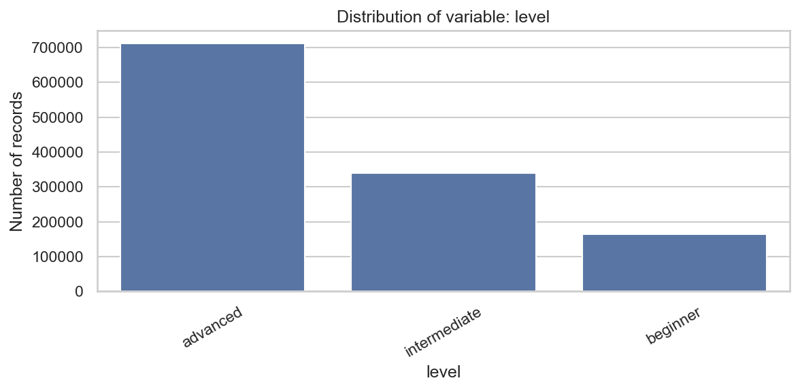

Wykres potwierdza przewagę rekordów użytkowników `advanced`, co należy uwzględniać przy interpretacji wyników modelowania.

## 5.4. Rozkład splitów treningowych

W danych występują trzy rodzaje splitów treningowych: `ppl`, `fbw` i `upper_lower`. Najczęściej pojawia się split `ppl`, następnie `fbw`, a najrzadziej `upper_lower`.

| `split` | Liczba rekordów | Udział |
| --- | ---: | ---: |
| `ppl` | 491 392 | 40,42% |
| `fbw` | 404 067 | 33,24% |
| `upper_lower` | 320 143 | 26,34% |

Zróżnicowanie splitów jest ważne dla rekomendera, ponieważ sposób podziału treningu wpływa na dobór ćwiczeń, liczbę jednostek treningowych i strukturę tygodniowego planu. Obecność trzech splitów pozwala analizować zarówno plany całego ciała, jak i bardziej dzielone schematy treningowe.

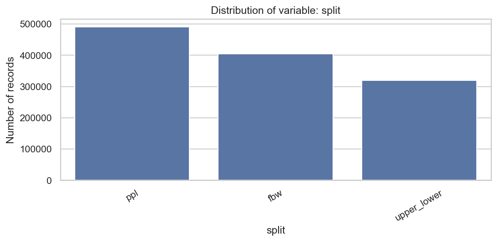

Rozkład splitów pokazuje, że dataset zawiera wszystkie schematy używane później przez rekomender, przy największym udziale splitu `ppl`.

## 5.5. Rozkład faz treningowych

Zmienna `phase` opisuje fazę treningową, w której znajduje się użytkownik. W danych występują trzy fazy: `hypertrophy`, `strength` i `deload`.

| `phase` | Liczba rekordów | Udział |
| --- | ---: | ---: |
| `hypertrophy` | 740 717 | 60,93% |
| `strength` | 407 511 | 33,52% |
| `deload` | 67 374 | 5,54% |

Faza `hypertrophy` odpowiada treningowi nastawionemu na większą objętość i zwykle wyższy zakres powtórzeń. Faza `strength` koncentruje się na pracy z większą intensywnością i niższą liczbą powtórzeń. Faza `deload` reprezentuje lżejszy okres treningowy, którego celem jest obniżenie obciążenia i zmęczenia. Niewielki udział `deload` jest zgodny z jego funkcją jako krótkiego okresu przejściowego.

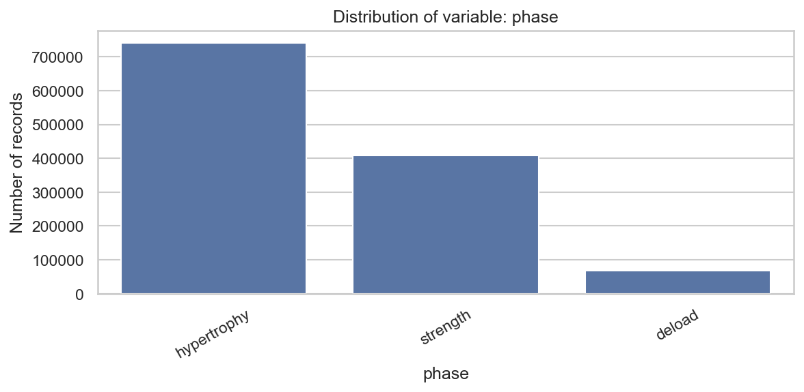

Wykres pokazuje dominację fazy `hypertrophy` oraz mniejszy udział fazy `deload`, co jest zgodne z jej krótszym charakterem treningowym.

## 5.6. Analiza ćwiczeń

W zbiorze występuje 15 ćwiczeń obejmujących główne wzorce ruchowe: przysiad, martwy ciąg, wyciskania, przyciągania/wiosłowania oraz ćwiczenia akcesoryjne. Najczęściej występujące ćwiczenia przedstawiono poniżej.

| Ćwiczenie | Liczba rekordów |
| --- | ---: |
| `Shoulder Press` | 145 950 |
| `Squat` | 145 093 |
| `Barbell Row` | 114 808 |
| `Lat Pulldown` | 106 695 |
| `Deadlift` | 99 231 |
| `Bench Press` | 85 693 |
| `Leg Curl` | 75 780 |
| `Calf Raise` | 71 431 |
| `Leg Press` | 71 385 |
| `Seated Row` | 65 723 |

Lista ćwiczeń jest zróżnicowana i obejmuje zarówno ćwiczenia wielostawowe, jak i akcesoryjne. Dzięki temu dataset nadaje się do budowy planów treningowych obejmujących główne partie mięśniowe i różne typy jednostek treningowych.

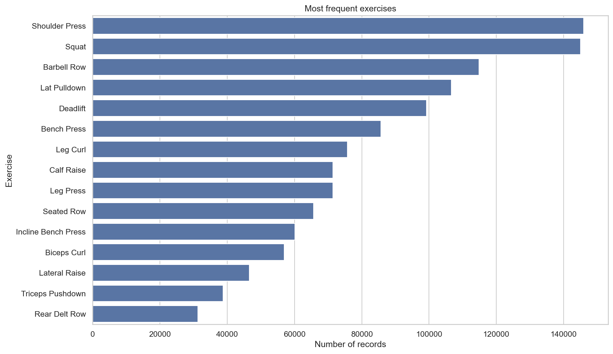

Najczęściej występujące ćwiczenia obejmują zarówno główne ruchy wielostawowe, jak i ćwiczenia akcesoryjne, co wspiera budowę zróżnicowanych planów.

## 5.7. Analiza objętości treningowej

W analizie EDA utworzono zmienną `volume`, zdefiniowaną jako iloczyn liczby powtórzeń i ciężaru:

`volume = reps * weight`

Objętość treningowa jest prostą miarą pracy wykonanej w serii. Pozwala porównywać treningi nie tylko przez pryzmat samego ciężaru, ale także liczby powtórzeń. Jest szczególnie przydatna przy agregacji do poziomu sesji, tygodnia albo miesiąca.

W aktualnym zbiorze średnia objętość pojedynczej serii wynosi 181,72, mediana 133,26, a maksymalna wartość 3 193,71. Po agregacji do poziomu sesji średnia objętość sesji wynosi 3 565,62, a mediana 2 570,59.

Trend miesięczny pokazuje wzrost całkowitej objętości w czasie. Najniższą miesięczną objętość odnotowano w lutym 2022 r. i wyniosła ona 2 593 065,53. Najwyższa wartość wystąpiła w grudniu 2024 r. i wyniosła 9 258 839,83. Taki trend jest spójny z założeniem generatora, w którym użytkownicy trenują przez dłuższy okres i mogą stopniowo zwiększać możliwości treningowe.

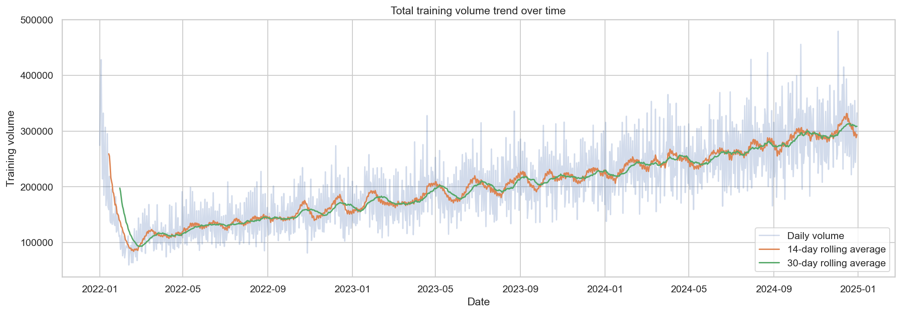

Wykres pokazuje wzrost objętości w czasie oraz wygładzone średnie kroczące, co ułatwia interpretację trendu generowanego przez dane syntetyczne.

## 5.8. Analiza użytkowników

Dataset pozwala analizować użytkowników indywidualnie, ponieważ każdy rekord zawiera `user_id`. Liczba sesji na użytkownika jest zróżnicowana: średnio wynosi 619,51, mediana 613,50, minimum 267, a maksimum 987 sesji. Tak duży zakres pokazuje, że użytkownicy różnią się systematycznością i długością aktywnej historii treningowej.

Analiza może być dodatkowo filtrowana według `level` i `sex`, co pozwala porównywać użytkowników o podobnym profilu. Jednocześnie EDA pokazuje, że nawet w obrębie tej samej grupy występują duże różnice w wynikach siłowych.

Przykład dla grupy `advanced male`:

| Ćwiczenie | Liczba użytkowników | Min. z maks. ciężaru użytkownika | Mediana z maks. ciężaru użytkownika | Maks. z maks. ciężaru użytkownika |
| --- | ---: | ---: | ---: | ---: |
| `Bench Press` | 54 | 28,4 kg | 52,3 kg | 138,2 kg |
| `Squat` | 54 | 51,8 kg | 91,4 kg | 300,0 kg |
| `Deadlift` | 54 | 21,2 kg | 70,9 kg | 280,3 kg |

Wniosek jest ważny dla systemu rekomendacyjnego: dwóch użytkowników z tym samym poziomem `advanced` i tą samą kategorią `sex` może wymagać bardzo różnych obciążeń. Dlatego rekomendacje ciężaru powinny korzystać z historii użytkownika albo z kalibracji siłowej, a nie tylko z etykiety poziomu zaawansowania.

## 5.9. Wnioski z EDA

EDA potwierdziła, że dataset ma strukturę umożliwiającą dalsze modelowanie. Zbiór zawiera wymagane kolumny, nie ma braków danych ani duplikatów, obejmuje ponad 1,2 mln rekordów i pozwala analizować treningi na poziomie serii, sesji oraz użytkownika.

W danych występują zróżnicowane ćwiczenia, fazy treningowe i splity, co jest istotne dla budowy rekomendera. Rozkłady kategorii nie są idealnie równomierne, ale odzwierciedlają różne profile użytkowników i typy treningu. Analiza objętości pokazała, że zmienna `volume` jest przydatna do opisu pracy treningowej oraz obserwacji trendów w czasie.

Wyniki EDA uzasadniają tworzenie cech historycznych, takich jak poprzedni ciężar, poprzednia liczba powtórzeń, poprzedni RIR, poprzednie zmęczenie i średnie kroczące. Dane treningowe mają charakter sekwencyjny, dlatego historia użytkownika jest kluczowa dla przewidywania kolejnych obciążeń.

Najważniejszy wniosek metodologiczny dotyczy zmiennej `level`. Poziom zaawansowania samodzielnie nie wystarcza do określenia absolutnej siły użytkownika. EDA potwierdza więc potrzebę systemu hybrydowego, który łączy model ML, historię użytkownika, dane podobnych użytkowników, reguły bezpieczeństwa oraz kalibrację siłową.

# 6. Przygotowanie danych do modelowania

Rozdział opisuje sposób przygotowania danych w Etapie 2 projektu, realizowanym w skrypcie `scripts/02_modeling_and_recommendation.py`. Celem tego etapu było zbudowanie zbioru modelowego, przygotowanie cech historycznych, wykonanie podziału train/test oraz porównanie kilku modeli regresyjnych przewidujących ciężar treningowy.

## 6.1. Definicja problemu predykcyjnego

Zadanie zostało zdefiniowane jako problem regresyjny. Celem modelu jest przewidywanie wartości `weight`, czyli ciężaru treningowego w kilogramach dla pojedynczej serii ćwiczenia. Predykcja jest wyznaczana na podstawie profilu użytkownika, ćwiczenia, parametrów planowanej serii, fazy treningowej oraz cech historycznych opisujących wcześniejsze wykonania tego samego ćwiczenia przez danego użytkownika.

Model nie stanowi całego systemu rekomendacyjnego. Jest jednym z jego komponentów i wspiera dobór sugerowanego obciążenia. Finalna rekomendacja może być później skorygowana przez historię użytkownika, kalibrację siłową, dane podobnych użytkowników oraz reguły bezpieczeństwa. Takie podejście jest ważne, ponieważ rekomendacja treningowa nie powinna wynikać wyłącznie z wartości przewidzianej przez model.

## 6.2. Zmienna docelowa

Zmienną docelową jest `weight`, czyli ciężar roboczy użyty w konkretnej serii treningowej. Wybór tej zmiennej wynika z celu projektu: system ma wspierać użytkownika w określeniu obciążenia, które pasuje do ćwiczenia, liczby powtórzeń, poziomu trudności oraz wcześniejszej historii treningowej.

Predykcję `weight` należy interpretować jako sugerowany ciężar w kilogramach. Nie jest to jednak automatyczne zalecenie do bezpośredniego wykonania. W praktycznym systemie wartość przewidziana przez model powinna być traktowana jako punkt wyjścia, który może zostać ograniczony przez reguły bezpieczeństwa, aktualny poziom zmęczenia, RIR oraz kontekst użytkownika.

## 6.3. Cechy wejściowe

W Etapie 2 wykorzystano 19 cech wejściowych. Można je podzielić na trzy grupy: cechy kategoryczne, cechy numeryczne opisujące bieżącą serię oraz cechy historyczne.

Cechy kategoryczne:

| Cecha | Znaczenie |
| --- | --- |
| `exercise` | Nazwa ćwiczenia, dla którego przewidywany jest ciężar. |
| `level` | Poziom zaawansowania użytkownika. |
| `split` | Typ splitu treningowego. |
| `phase` | Aktualna faza treningowa. |
| `sex` | Kategoria płci syntetycznego użytkownika. |

Cechy numeryczne bieżącej serii:

| Cecha | Znaczenie |
| --- | --- |
| `set_number` | Numer serii w ramach ćwiczenia. |
| `reps` | Planowana lub wykonana liczba powtórzeń. |
| `fatigue` | Poziom zmęczenia powiązany z serią. |
| `rir` | Liczba powtórzeń pozostających w zapasie. |

Cechy historyczne obejmują poprzednie wartości oraz średnie kroczące dla użytkownika i ćwiczenia. Są one opisane dokładniej w podrozdziale 6.5. Cechy kategoryczne są kodowane one-hot w pipeline modelującym, a dla Ridge Regression cechy numeryczne są dodatkowo standaryzowane.

## 6.4. Feature engineering

Przed modelowaniem wykonano kilka przekształceń danych. Najpierw do zbioru dodano zmienną `volume`, zdefiniowaną jako:

`volume = reps * weight`

Jest to prosta miara pracy wykonanej w serii. Następnie obliczono przybliżone `e1rm_epley` według wzoru:

`e1rm_epley = weight * (1 + reps / 30)`

Wartość `e1rm_epley` służy jako orientacyjny wskaźnik siły i element inspekcji danych, natomiast właściwy model predykcyjny przewiduje bezpośrednio `weight`.

Kolejnym krokiem było posortowanie danych według `user_id`, `exercise`, `date`, `session_id` i `set_number`. Taka kolejność jest potrzebna, aby poprawnie utworzyć cechy historyczne. Dane treningowe mają charakter sekwencyjny, więc poprzednie serie tego samego użytkownika w tym samym ćwiczeniu powinny poprzedzać obserwację, dla której tworzona jest predykcja.

Po utworzeniu cech historycznych usunięto rekordy, dla których brakowało wymaganych wartości wejściowych. Z początkowych 1 215 602 rekordów powstał zbiór model-ready zawierający 1 211 945 rekordów.

Najważniejszy fragment implementacji znajduje się w `scripts/02_modeling_and_recommendation.py`. Kod tworzy `volume`, `e1rm_epley`, sortuje dane w czasie i buduje cechy opóźnione oraz średnie kroczące.

```python
df["volume"] = df["reps"] * df["weight"]
df["e1rm_epley"] = df["weight"] * (1 + df["reps"] / 30)

df = (
    df
    .sort_values(["user_id", "exercise", "date", "session_id", "set_number"])
    .reset_index(drop=True)
)

df["prev_weight"] = df.groupby(["user_id", "exercise"])["weight"].shift(1)
df["prev_reps"] = df.groupby(["user_id", "exercise"])["reps"].shift(1)
df["prev_rir"] = df.groupby(["user_id", "exercise"])["rir"].shift(1)
df["prev_fatigue"] = df.groupby(["user_id", "exercise"])["fatigue"].shift(1)
df["prev_volume"] = df.groupby(["user_id", "exercise"])["volume"].shift(1)

for col in ["weight", "reps", "rir", "fatigue", "volume"]:
    df[f"rolling_{col}_3"] = (
        df
        .groupby(["user_id", "exercise"])[col]
        .transform(lambda x: x.shift(1).rolling(3).mean())
    )
```

Zastosowanie `shift(1)` jest ważne, ponieważ zabezpiecza przed użyciem informacji z bieżącej serii przy tworzeniu predykcji dla tej samej obserwacji.

## 6.5. Cechy historyczne

Cechy historyczne zostały zbudowane osobno dla pary `user_id` i `exercise`. Dzięki temu opisują wcześniejsze wykonania tego samego ćwiczenia przez konkretnego użytkownika, a nie ogólną średnią dla całej populacji.

W Etapie 2 utworzono następujące cechy opóźnione:

| Cecha | Znaczenie |
| --- | --- |
| `prev_weight` | Ciężar z poprzedniej serii tego użytkownika w danym ćwiczeniu. |
| `prev_reps` | Liczba powtórzeń z poprzedniej serii. |
| `prev_rir` | RIR z poprzedniej serii. |
| `prev_fatigue` | Zmęczenie z poprzedniej serii. |
| `prev_volume` | Objętość poprzedniej serii. |

Dodatkowo utworzono średnie kroczące z trzech wcześniejszych obserwacji:

| Cecha | Znaczenie |
| --- | --- |
| `rolling_weight_3` | Średni ciężar z trzech poprzednich serii. |
| `rolling_reps_3` | Średnia liczba powtórzeń z trzech poprzednich serii. |
| `rolling_rir_3` | Średni RIR z trzech poprzednich serii. |
| `rolling_fatigue_3` | Średnie zmęczenie z trzech poprzednich serii. |
| `rolling_volume_3` | Średnia objętość z trzech poprzednich serii. |

Historia jest szczególnie ważna w tym problemie, ponieważ najlepszą informacją o kolejnym ciężarze jest zwykle wcześniejszy ciężar użytkownika w tym samym ćwiczeniu. Cechy historyczne pomagają modelowi uwzględnić indywidualny poziom siły, tempo progresji oraz ostatni kontekst treningowy.

## 6.6. Podział train/test

W skrypcie zastosowano podział czasowy, a nie losowy podział całego zbioru. Datą graniczną jest kwantyl 0.8 kolumny `date` w zbiorze model-ready, czyli `2024-07-05`. Obserwacje z datą mniejszą lub równą tej wartości trafiły do zbioru treningowego, a późniejsze obserwacje do zbioru testowego.

Przed próbkowaniem zbiór treningowy zawierał 970 668 rekordów z okresu od 2022-01-01 do 2024-07-05, a zbiór testowy 241 277 rekordów z okresu od 2024-07-06 do 2024-12-30. Na potrzeby porównania modeli zastosowano próbkowanie: maksymalnie 250 000 rekordów treningowych i 100 000 rekordów testowych.

Taki podział lepiej odzwierciedla realny scenariusz użycia modelu. Model uczy się na wcześniejszych treningach, a następnie przewiduje obciążenia dla późniejszych obserwacji.

W implementacji podział czasowy został wykonany na podstawie kwantyla 0.8 kolumny `date`.

```python
cutoff_date = model_ready["date"].quantile(0.8)
train_df = model_ready[model_ready["date"] <= cutoff_date].copy()
test_df = model_ready[model_ready["date"] > cutoff_date].copy()

train_df_sample = train_df.sample(
    min(len(train_df), MAX_TRAIN_SAMPLE),
    random_state=RANDOM_STATE,
)
test_df_sample = test_df.sample(
    min(len(test_df), MAX_TEST_SAMPLE),
    random_state=RANDOM_STATE,
)

X_train = train_df_sample[FEATURES]
y_train = train_df_sample[TARGET]
X_test = test_df_sample[FEATURES]
y_test = test_df_sample[TARGET]
```

Próbkowanie ogranicza czas eksperymentów, ale zachowuje zasadę trenowania na wcześniejszych obserwacjach i testowania na późniejszych.

## 6.7. Baseline

Jako punkt odniesienia zastosowano baseline `naive_prev_weight`. Jest to prosta reguła, która jako predykcję przyjmuje poprzedni ciężar użytkownika w tym samym ćwiczeniu, czyli wartość `prev_weight`.

Baseline jest ważny, ponieważ w danych treningowych poprzedni ciężar jest bardzo silnym punktem odniesienia dla kolejnej serii. Model ML ma sens praktyczny tylko wtedy, gdy daje wartość ponad taką prostą regułę. Porównanie z `naive_prev_weight` pozwala więc sprawdzić, czy bardziej złożone modele faktycznie poprawiają jakość predykcji.

# 7. Modelowanie i wybór modelu

W Etapie 2 porównano trzy modele uczenia maszynowego oraz baseline oparty na poprzednim ciężarze. Wszystkie modele były oceniane na tym samym zbiorze testowym, z wykorzystaniem metryk regresyjnych oraz praktycznych progów błędu wyrażonych w kilogramach.

## 7.1. Testowane modele

Porównano następujące podejścia:

| Model | Rola w eksperymencie |
| --- | --- |
| `naive_prev_weight` | Prosty baseline przewidujący ciężar jako poprzedni ciężar użytkownika w danym ćwiczeniu. |
| Ridge Regression | Model liniowy z regularyzacją, traktowany jako prosty i interpretowalny punkt odniesienia ML. |
| Random Forest | Model nieliniowy oparty na wielu drzewach decyzyjnych, dobrze dopasowany do danych tabelarycznych. |
| HistGradientBoosting | Model boostingowy, który sekwencyjnie buduje drzewa i koryguje błędy poprzednich estymatorów. |

Random Forest został skonfigurowany z 120 drzewami, maksymalną głębokością 16 i minimalną liczbą 3 próbek w liściu. HistGradientBoosting wykorzystywał 250 iteracji, learning rate 0.06 oraz regularyzację L2. Ridge Regression korzystał ze standaryzacji cech numerycznych.

Fragment z `scripts/02_modeling_and_recommendation.py` pokazuje wspólny pipeline preprocessingowy i porównywane modele. Cechy kategoryczne są kodowane przez `ColumnTransformer`, a każdy model jest opakowany w `Pipeline`.

```python
def build_preprocessor(scale_numeric=False):
    numeric_transformer = StandardScaler() if scale_numeric else "passthrough"
    return ColumnTransformer(
        transformers=[
            ("cat", make_one_hot_encoder(), categorical_features),
            ("num", numeric_transformer, numeric_features),
        ]
    )

models = {
    "ridge_regression": Pipeline([
        ("preprocessor", build_preprocessor(scale_numeric=True)),
        ("model", Ridge(alpha=1.0)),
    ]),
    "random_forest": Pipeline([
        ("preprocessor", build_preprocessor(scale_numeric=False)),
        ("model", RandomForestRegressor(
            n_estimators=120,
            max_depth=16,
            min_samples_leaf=3,
            random_state=RANDOM_STATE,
            n_jobs=-1,
        )),
    ]),
    "hist_gradient_boosting": Pipeline([
        ("preprocessor", build_preprocessor(scale_numeric=False)),
        ("model", HistGradientBoostingRegressor(
            max_iter=250,
            learning_rate=0.06,
            max_leaf_nodes=31,
            l2_regularization=0.1,
            random_state=RANDOM_STATE,
        )),
    ]),
}
```

Taki układ ułatwia porównanie modeli, ponieważ każdy z nich otrzymuje ten sam zestaw cech i ten sam sposób przygotowania danych.

## 7.2. Metryki oceny

Do oceny modeli wykorzystano kilka metryk. Główną metryką wyboru modelu było MAE, ponieważ jest najbardziej intuicyjne w tym projekcie: informuje, o ile kilogramów średnio myli się model.

Pozostałe metryki pełnią funkcję uzupełniającą:

| Metryka | Interpretacja |
| --- | --- |
| MAE | Średni błąd bezwzględny w kilogramach. |
| RMSE | Pierwiastek średniego błędu kwadratowego; mocniej karze duże błędy. |
| R² | Miara dopasowania modelu do danych testowych. |
| Within 2.5 kg | Odsetek predykcji z błędem nie większym niż 2,5 kg. |
| Within 5 kg | Odsetek predykcji z błędem nie większym niż 5 kg. |
| Within 10 kg | Odsetek predykcji z błędem nie większym niż 10 kg. |

Progi 2,5 kg, 5 kg i 10 kg są praktyczne w kontekście treningu siłowego, ponieważ ciężary na siłowni często zmieniają się skokowo, a różnica kilku kilogramów może mieć inne znaczenie dla ćwiczeń akcesoryjnych niż dla dużych ćwiczeń wielostawowych.

Metryki były liczone jedną funkcją, aby uniknąć różnic w sposobie oceny poszczególnych modeli.

```python
def calculate_regression_metrics(model_name, y_true, y_pred):
    y_pred = np.maximum(np.asarray(y_pred), 0)
    y_true = np.asarray(y_true)
    abs_error = np.abs(y_true - y_pred)

    return {
        "model": model_name,
        "MAE": mean_absolute_error(y_true, y_pred),
        "RMSE": np.sqrt(mean_squared_error(y_true, y_pred)),
        "R2": r2_score(y_true, y_pred),
        "within_2_5kg_percent": np.mean(abs_error <= 2.5) * 100,
        "within_5kg_percent": np.mean(abs_error <= 5.0) * 100,
        "within_10kg_percent": np.mean(abs_error <= 10.0) * 100,
    }
```

Funkcja zwraca zarówno klasyczne metryki regresyjne, jak i progi błędu łatwe do zinterpretowania w kilogramach.

## 7.3. Wyniki porównania modeli

Tabela przedstawia wyniki zapisane lokalnie w `outputs/stage2_outputs/model_comparison_results.csv`.

| Model | MAE | RMSE | R² | Within 2.5 kg | Within 5 kg | Within 10 kg |
| --- | ---: | ---: | ---: | ---: | ---: | ---: |
| Random Forest | 3.8604 | 7.1335 | 0.9625 | 57.221% | 77.287% | 91.473% |
| Ridge Regression | 3.8780 | 6.9160 | 0.9648 | 56.354% | 77.344% | 91.601% |
| HistGradientBoosting | 3.9486 | 7.7548 | 0.9557 | 57.307% | 77.449% | 91.599% |
| Naive baseline | 4.6917 | 8.5286 | 0.9464 | 51.105% | 71.867% | 88.186% |

Wszystkie modele ML uzyskały niższe MAE niż baseline `naive_prev_weight`, co oznacza poprawę względem prostej reguły opartej na poprzednim ciężarze. Najniższe MAE uzyskał Random Forest. Różnica względem Ridge Regression była jednak niewielka, a Ridge Regression osiągnął minimalnie lepsze RMSE, R² oraz odsetek predykcji w progach 5 kg i 10 kg. HistGradientBoosting również poprawił wynik względem baseline, choć według MAE był słabszy od dwóch pozostałych modeli ML.

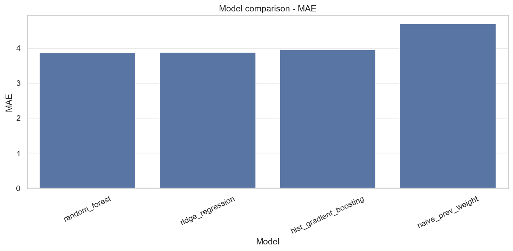

Wykres MAE pokazuje niewielkie różnice między modelami ML oraz wyraźną poprawę względem baseline `naive_prev_weight`.

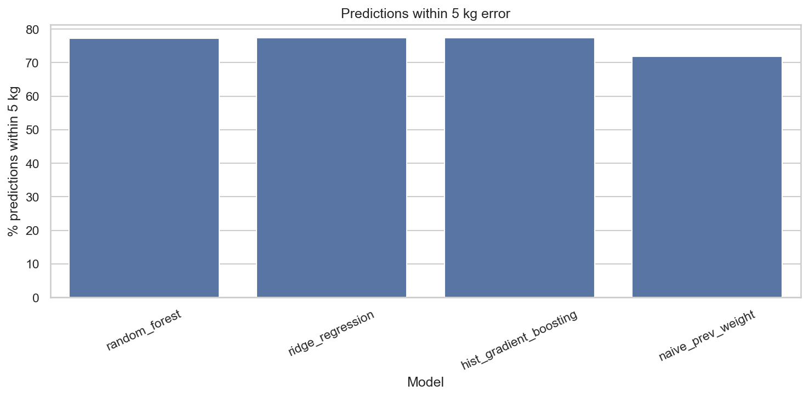

Wykres within 5 kg uzupełnia MAE o praktyczną interpretację: pokazuje, jak często błąd mieści się w zakresie możliwym do odczytania jako tolerancja kilku kilogramów.

## 7.4. Wybór modelu finalnego

Finalnym modelem został Random Forest, ponieważ uzyskał najlepszy wynik według głównej metryki wyboru, czyli MAE. Jego średni błąd bezwzględny wyniósł 3.8604 kg.

Wybór należy interpretować ostrożnie. Random Forest nie był zdecydowanie lepszy od Ridge Regression; różnica MAE wyniosła około 0.018 kg. Decyzja wynikała z przyjętego kryterium wyboru, zgodnie z którym najważniejsze było minimalizowanie średniego błędu w kilogramach.

Wytrenowany model został zapisany lokalnie jako artefakt `models/best_weight_prediction_model.joblib`. Plik `.joblib` nie powinien być przechowywany w zwykłym Git ze względu na rozmiar i charakter artefaktu modelowego. Może zostać odtworzony przez uruchomienie Etapu 2 albo udostępniony osobno.

Wybór i zapis modelu są realizowane po posortowaniu wyników według MAE. Fragment poniżej pokazuje, że baseline służy do porównania, ale finalny artefakt jest wybierany spośród modeli ML.

```python
results_df = pd.DataFrame(all_results).sort_values("MAE")
results_df.to_csv(
    os.path.join(OUTPUT_DIR, "model_comparison_results.csv"),
    index=False,
)

ml_results_df = results_df[results_df["model"] != "naive_prev_weight"].copy()
best_model_name = ml_results_df.iloc[0]["model"]
best_pipeline = trained_models[best_model_name]

joblib.dump(best_pipeline, MODEL_FILENAME)
```

Ten zapis pozwala później używać modelu w demonstratorze i dashboardzie bez ponownego trenowania.

## 7.5. Interpretacja wyników

MAE na poziomie około 3.86 kg oznacza, że przeciętny błąd predykcji Random Forest wynosi mniej niż 4 kg. Jest to wynik łatwy do interpretacji w kontekście treningu siłowego, ponieważ odnosi się bezpośrednio do jednostki obciążenia używanej w praktyce.

W porównaniu z baseline `naive_prev_weight` model poprawił MAE o około 0.8313 kg, czyli o 17.72%. Oznacza to, że model ML wykorzystuje dodatkowe informacje ponad sam poprzedni ciężar. Jednocześnie wynik nie oznacza gotowości do bezpośredniego stosowania rekomendacji w praktyce. Model uczy się wzorców z syntetycznego datasetu, a nie z realnych danych użytkowników.

Warto też pamiętać, że ten sam błąd w kilogramach może mieć różne znaczenie dla różnych ćwiczeń. Błąd 4 kg jest relatywnie większy przy ćwiczeniach akcesoryjnych niż przy ciężkich bojach, takich jak `Squat` czy `Deadlift`. Dlatego predykcja modelu powinna być dalej korygowana przez reguły bezpieczeństwa i kontekst użytkownika.

## 7.6. Ewaluacja grupowa

W Etapie 2 przeprowadzono również ewaluację grupową najlepszego modelu. Wyniki zostały policzone osobno dla zmiennych `level`, `phase`, `sex` i `exercise`. Celem tej analizy było sprawdzenie, czy model działa podobnie w różnych segmentach danych, czy też w niektórych grupach popełnia większe błędy.

Przykładowe wyniki według `level` pokazują zróżnicowanie jakości predykcji:

| `level` | Rekordy testowe | MAE | Within 5 kg |
| --- | ---: | ---: | ---: |
| `intermediate` | 17 117 | 2.6238 | 85.120% |
| `beginner` | 1 838 | 3.3981 | 77.911% |
| `advanced` | 81 045 | 4.1321 | 75.618% |

Wyniki według `sex` również różnią się między grupami:

| `sex` | Rekordy testowe | MAE | Within 5 kg |
| --- | ---: | ---: | ---: |
| `female` | 24 562 | 1.8773 | 91.694% |
| `male` | 75 438 | 4.5061 | 72.596% |

Analiza według `phase` wskazała MAE 3.8019 dla `hypertrophy`, 3.8850 dla `strength` oraz 4.2896 dla `deload`. W przekroju ćwiczeń błędy były najmniejsze dla ćwiczeń akcesoryjnych, takich jak `Lateral Raise` (MAE 0.5502), a największe dla ciężkich ćwiczeń dolnej części ciała, np. `Squat` (MAE 8.8879), `Leg Press` (MAE 5.5571) i `Deadlift` (MAE 5.1447).

[Miejsce na wykres: ewaluacja modelu według `level`, `phase`, `sex` i `exercise`]

W lokalnych wynikach nie znaleziono osobnego obrazu ewaluacji grupowej. Wyniki segmentowe pozostają więc opisane tabelarycznie, a dodatkowy obraz może zostać uzupełniony po wygenerowaniu takiego wykresu.

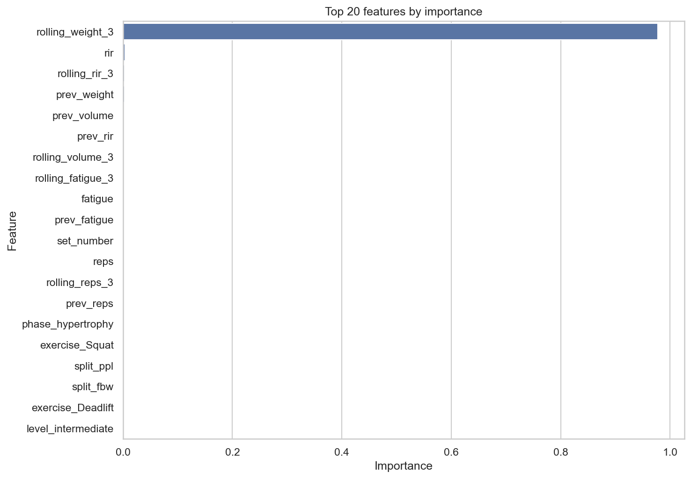

Wykres ważności cech wspiera interpretację modelu Random Forest. Pokazuje, które zmienne miały największy wpływ na predykcję `weight`, choć nie zastępuje pełnej analizy przyczynowej.

Ewaluacja grupowa pokazuje, że ocena modelu nie powinna ograniczać się do jednej metryki globalnej. Różnice między poziomami, płcią, fazami i ćwiczeniami pomagają wskazać obszary, w których model może wymagać dodatkowych reguł, kalibracji albo większej ostrożności interpretacyjnej.

## 7.7. Wnioski z modelowania

Modelowanie potwierdziło, że na podstawie danych treningowych można przewidywać ciężar użyty w serii z błędem możliwym do interpretacji w kilogramach. Wszystkie testowane modele ML poprawiły wynik względem prostego baseline opartego na `prev_weight`, co wskazuje, że dodatkowe cechy opisujące użytkownika, ćwiczenie, fazę i historię treningową wnoszą wartość predykcyjną.

Najlepszy wynik według głównej metryki MAE uzyskał Random Forest, ale przewaga nad Ridge Regression była niewielka. Oznacza to, że w projekcie ważniejsza od samego wyboru jednego algorytmu jest cała procedura przygotowania danych, wykorzystanie cech historycznych i prawidłowa interpretacja wyników.

Historia użytkownika okazała się kluczowa, ponieważ pozwala modelowi odnosić predykcję do rzeczywistego poziomu siły w konkretnym ćwiczeniu. Jednocześnie model powinien być traktowany jako komponent systemu rekomendacyjnego, a nie jako samodzielny trener. Finalna rekomendacja obciążenia wymaga połączenia predykcji ML z historią użytkownika, kalibracją siłową, danymi podobnych użytkowników oraz regułami bezpieczeństwa.

# 8. System rekomendacyjny

System rekomendacyjny stanowi finalną warstwę logiczną projektu. Jego zadaniem nie jest wyłącznie przewidzenie ciężaru, ale wygenerowanie kompletnego planu treningowego uwzględniającego profil użytkownika, strukturę tygodnia, dobór ćwiczeń, parametry serii, predykcję modelu ML oraz reguły bezpieczeństwa.

## 8.1. Założenia systemu rekomendacyjnego

Rekomender ma charakter hybrydowy. Oznacza to, że nie opiera się wyłącznie na modelu ML, lecz łączy kilka źródeł informacji i reguł decyzyjnych. W implementacji uwzględniane są między innymi:

* profil użytkownika,
* poziom zaawansowania `level`,
* płeć `sex`,
* faza treningowa `phase`,
* liczba dni treningowych w tygodniu,
* historia użytkownika, jeżeli jest dostępna,
* dane podobnych użytkowników,
* model ML z Etapu 2,
* kalibracja siłowa dla nowych użytkowników,
* reguły bezpieczeństwa.

Głównym produktem systemu jest tygodniowy plan treningowy. Sugerowany ciężar jest ważnym elementem planu, ale pozostaje tylko jednym z komponentów rekomendacji. Model ML nie pełni roli samodzielnego trenera; przewiduje obciążenie, które następnie jest interpretowane w szerszym kontekście użytkownika.

## 8.2. Rekomendacja splitu

Dobór splitu zależy od liczby dni treningowych w tygodniu. Implementacja stosuje prostą, czytelną regułę:

| Liczba dni treningowych | Rekomendowany split |
| ---: | --- |
| 2 lub mniej | `fbw` |
| 3 | `ppl` |
| 4 | `upper_lower` |
| 5 lub więcej | `ppl` |

Reguła ta pozwala szybko dopasować strukturę planu do dostępności użytkownika. `fbw` jest stosowany przy mniejszej liczbie dni, ponieważ trening całego ciała lepiej wykorzystuje ograniczoną liczbę jednostek. `ppl` sprawdza się przy trzech lub większej liczbie dni, a `upper_lower` jest wybierany dla czterech dni treningowych.

W `src/recommendation_engine.py` dobór splitu jest zaimplementowany jako prosta reguła decyzyjna.

```python
def choose_recommended_split(days_per_week: int) -> tuple[str, str]:
    if days_per_week <= 2:
        return "fbw", "Selected FBW because the profile has at most 2 training days."
    if days_per_week == 3:
        return "ppl", "Selected PPL because the profile has 3 training days."
    if days_per_week == 4:
        return "upper_lower", "Selected upper/lower because the profile has 4 training days."
    return "ppl", "Selected PPL because the profile has 5 or more training days."
```

Reguła jest celowo czytelna, ponieważ w projekcie pełni funkcję demonstracyjną i ma być łatwa do interpretacji w dashboardzie.

## 8.3. Dobór ćwiczeń

Ćwiczenia są dobierane na podstawie kategorii ruchu oraz wybranego splitu. W kodzie ćwiczenia są mapowane na kategorie `push`, `pull` i `legs`. Przykładowo `Bench Press`, `Shoulder Press` i `Triceps Pushdown` należą do kategorii `push`, ćwiczenia takie jak `Barbell Row`, `Lat Pulldown` i `Biceps Curl` do `pull`, a `Squat`, `Deadlift`, `Leg Press` i `Leg Curl` do `legs`.

Dla splitu `ppl` system tworzy dni Push, Pull i Legs. Dla `upper_lower` tworzone są dni Upper i Lower, a dla `fbw` dni Full Body. Każdy dzień ma przypisane docelowe kategorie ćwiczeń i orientacyjną liczbę ćwiczeń. W planach demonstracyjnych dzień Push i Pull może zawierać do 6 ćwiczeń, dzień Legs do 5 ćwiczeń, a dzień Full Body do 6 ćwiczeń.

Rekomender najpierw próbuje korzystać z danych podobnych użytkowników. Filtry obejmują kolejno `sex`, `level`, `phase` i `split`, a jeśli zbiór byłby pusty, system stopniowo rozluźnia warunki: najpierw pomija część cech profilu, następnie przechodzi do danych z tym samym poziomem, a ostatecznie do całego datasetu. Dzięki temu plan może zostać wygenerowany także wtedy, gdy dla bardzo konkretnego profilu brakuje idealnie dopasowanych rekordów.

## 8.4. Dobór parametrów serii

Parametry serii są wyznaczane na podstawie danych podobnych użytkowników oraz fazy treningowej. Liczba serii jest ustalana na podstawie mediany maksymalnego numeru serii dla danego ćwiczenia w podobnych danych, a następnie ograniczana do zakresu od 2 do 5. Liczba powtórzeń pochodzi z mediany `reps` dla danego ćwiczenia i jest ograniczana do zakresu od 3 do 15.

Faza treningowa wpływa na docelowy RIR i poziom zmęczenia:

| `phase` | `target_rir` | `target_fatigue` | Interpretacja |
| --- | ---: | ---: | --- |
| `hypertrophy` | 2 | 6 | Większa objętość i umiarkowana intensywność. |
| `strength` | 2 | 7 | Niższy zakres powtórzeń i większa intensywność. |
| `deload` | 4 | 3 | Redukcja obciążenia i zmęczenia. |

Takie ustawienia pozwalają odróżnić plan ukierunkowany na hipertrofię od planu siłowego i tygodnia deload. W szczególności faza `deload` celowo zwiększa zapas powtórzeń i obniża zmęczenie.

## 8.5. Wykorzystanie modelu ML w rekomenderze

Rekomender wykorzystuje model przygotowany w Etapie 2. Model jest ładowany z pliku `models/best_weight_prediction_model.joblib`, jeżeli plik jest dostępny lokalnie. Dla każdego ćwiczenia system buduje pojedynczy rekord wejściowy z cechami zgodnymi z etapem modelowania: `exercise`, `level`, `split`, `phase`, `sex`, parametrami serii oraz cechami historycznymi.

Wynikiem predykcji jest `model_predicted_weight`, czyli przewidywany ciężar dla danej pozycji planu. Wartość ta nie musi być jednak finalnym ciężarem prezentowanym użytkownikowi. Finalna rekomendacja może zostać ograniczona przez historię użytkownika, kalibrację siłową albo reguły bezpieczeństwa. W planie końcowym obok predykcji modelu pojawia się `final_recommended_weight`, czyli ciężar po zastosowaniu logiki rekomendacyjnej.

## 8.6. Reguły bezpieczeństwa

Reguły bezpieczeństwa ograniczają zbyt agresywne rekomendacje ciężaru. Ich celem jest przekształcenie predykcji modelu w wartość bardziej praktyczną i ostrożną. Finalny ciężar jest zaokrąglany do najbliższego skoku 2,5 kg, co odpowiada typowym zmianom obciążenia na siłowni.

W implementacji uwzględniono kilka mechanizmów:

* ograniczenie maksymalnego wzrostu względem poprzedniego ciężaru,
* ograniczenie rekomendacji przy wysokim zmęczeniu,
* ograniczenie rekomendacji przy niskim RIR,
* redukcję ciężaru w fazie `deload`,
* bardziej ostrożny limit progresji dla starszych użytkowników.

Podstawowy limit progresji zależy od poziomu zaawansowania: 3% dla `beginner`, 4% dla `intermediate` i 5% dla `advanced`. Dla użytkowników od 45 lat limit może zostać ograniczony do 3%, a dla użytkowników od 60 lat do 2%. W fazie `deload` rekomendowany ciężar jest ograniczany do maksymalnie 85% punktu odniesienia.

Znaczenie typów korekt:

| Wartość `safety_adjustment` | Znaczenie |
| --- | --- |
| `no_adjustment` | Brak dodatkowej korekty; rekomendacja mieści się w bezpiecznym zakresie. |
| `limited_by_progression_cap` | Ciężar ograniczono przez maksymalny dopuszczalny wzrost progresji. |
| `limited_by_high_fatigue_or_low_rir` | Ciężar ograniczono z powodu wysokiego zmęczenia albo niskiego RIR. |
| `deload_reduction` | Ciężar obniżono ze względu na fazę `deload`. |
| `age_adjusted_progression_cap` | Limit progresji zaostrzono ze względu na wiek użytkownika. |

## 8.7. Problem cold start

Problem cold start dotyczy użytkownika, dla którego system nie ma historii treningowej. W takim przypadku model nie zna poprzednich ciężarów użytkownika w konkretnych ćwiczeniach, a więc traci najważniejszy punkt odniesienia dla predykcji obciążenia.

Sam wiek, płeć i poziom zaawansowania nie wystarczają do wiarygodnego przewidywania absolutnego ciężaru. Zmienna `level` jest ogólną kategorią, a nie bezpośrednią miarą siły. Jak pokazano w EDA, użytkownicy `advanced` mogą mieć bardzo różne wyniki w tych samych ćwiczeniach. Dlatego rekomendacje dla nowych użytkowników powinny być traktowane jako orientacyjne, o ile nie zostaną uzupełnione kalibracją siłową.

## 8.8. Kalibracja siłowa nowych użytkowników

W Live Generatorze dodano mechanizm kalibracji siłowej dla nowych użytkowników. Użytkownik może podać aktualne ciężary robocze dla głównych ćwiczeń, takich jak `Bench Press`, `Squat`, `Deadlift`, `Barbell Row`, `Shoulder Press`, `Lat Pulldown` i `Leg Press`. Nie są to rekordy maksymalne, lecz wartości robocze, które mają stanowić punkt odniesienia dla planu.

Kalibracja jest wykorzystywana jako źródło finalnego ciężaru `strength_calibration`. Dla ćwiczeń bazowych system może użyć bezpośrednio podanych wartości, a dla ćwiczeń powiązanych stosuje proporcje względem ćwiczeń bazowych. Przykładowo `Incline Bench Press` może być wyznaczany względem `Bench Press`, `Lateral Raise` względem `Shoulder Press`, a `Leg Curl` względem `Squat`.

Wartości kalibracyjne są dodatkowo modyfikowane przez fazę treningową: `strength` używa pełniejszego punktu odniesienia, `hypertrophy` obniża ciężar przez współczynnik 0,88, a `deload` przez 0,7. Dzięki temu kalibracja częściowo rozwiązuje problem cold start, a model ML pozostaje komponentem wspierającym, a nie jedynym źródłem obciążenia.

Poniższy fragment z `src/recommendation_engine.py` pokazuje współczynniki faz oraz mapowanie ćwiczeń na ćwiczenia kalibracyjne.

```python
PHASE_WEIGHT_FACTORS = {
    "strength": 1.0,
    "hypertrophy": 0.88,
    "deload": 0.7,
}

CALIBRATION_ANCHORS = {
    "Bench Press": [("Bench Press", 1.0)],
    "Incline Bench Press": [("Bench Press", 0.8)],
    "Lateral Raise": [("Shoulder Press", 0.25)],
    "Lat Pulldown": [("Lat Pulldown", 1.0), ("Barbell Row", 0.75)],
    "Leg Press": [("Leg Press", 1.0), ("Squat", 1.2)],
    # ... pominięto mniej istotny fragment ...
}
```

Kalibracja nie zastępuje modelu, ale daje systemowi bezpieczniejszy punkt odniesienia dla nowych użytkowników bez historii.

## 8.9. Źródła finalnego ciężaru

Finalny ciężar może pochodzić z kilku źródeł, zależnie od dostępności historii i kalibracji. W aktualnej implementacji model zawsze generuje `model_predicted_weight`, ale `weight_source` dla finalnej rekomendacji przyjmuje przede wszystkim wartości opisujące źródło praktycznego punktu odniesienia:

| Źródło | Znaczenie |
| --- | --- |
| `user_history` | Wykorzystanie historii konkretnego użytkownika i jego wcześniejszych serii w danym ćwiczeniu. |
| `strength_calibration` | Wykorzystanie ciężarów roboczych podanych ręcznie przez nowego użytkownika. |
| `fallback_median` | Wartość orientacyjna oparta na medianach z danych podobnych użytkowników lub całego datasetu. |

Predykcja modelu jest więc punktem odniesienia dla logiki rekomendacyjnej i reguł bezpieczeństwa, ale finalny ciężar jest ustalany priorytetowo: najpierw na podstawie historii użytkownika, następnie kalibracji siłowej, a w razie ich braku przez fallback z danych podobnych użytkowników.

Najważniejszy fragment `generate_training_plan()` w `src/recommendation_engine.py` pokazuje ten priorytet bezpośrednio w kodzie.

```python
predicted_weight = float(model.predict(model_input)[0])
calibrated_weight, calibration_reference = get_calibrated_weight(
    exercise,
    normalized_calibration,
    profile["phase"],
)

if history["history_available"]:
    final_weight, safety_adjustment = apply_safety_rules(
        predicted_weight,
        history,
        profile,
    )
    weight_source = "user_history"
elif calibrated_weight is not None and calibration_reference is not None:
    safety_history = history.copy()
    safety_history["prev_weight"] = calibration_reference
    safety_history["rolling_weight_3"] = calibration_reference
    final_weight, safety_adjustment = apply_safety_rules(
        calibrated_weight,
        safety_history,
        profile,
    )
    weight_source = "strength_calibration"
else:
    final_weight, safety_adjustment = apply_safety_rules(
        predicted_weight,
        history,
        profile,
    )
    weight_source = "fallback_median"

plan_rows.append({
    "model_predicted_weight": round(predicted_weight, 2),
    "final_recommended_weight": final_weight,
    "weight_source": weight_source,
    "safety_adjustment": safety_adjustment,
})
```

Kod pokazuje, że `model_predicted_weight` jest zawsze zapisywany, ale `weight_source` opisuje źródło finalnego punktu odniesienia: `user_history`, `strength_calibration` albo `fallback_median`.

## 8.10. Wnioski dotyczące rekomendera

Rekomender łączy dane, model ML, historię użytkownika, kalibrację siłową i reguły bezpieczeństwa. Takie podejście jest bardziej praktyczne niż użycie samego modelu regresyjnego, ponieważ pozwala generować cały plan treningowy, a nie tylko pojedynczą predykcję ciężaru.

Najważniejszą cechą systemu jest jego warstwowość. Model ML wspiera dobór obciążenia, ale struktura planu, dobór ćwiczeń, parametry serii i finalne korekty wynikają z dodatkowej logiki rekomendacyjnej. Dzięki temu system lepiej odpowiada na ograniczenia wynikające z cold start, zmęczenia, fazy treningowej i bezpieczeństwa użytkownika.

# 9. Demonstrator systemu - Etap 3

Etap 3 pełni rolę demonstratora systemu end-to-end. Pokazuje przepływ od profilu użytkownika, przez wczytanie modelu i przygotowanie cech, aż do wygenerowania tygodniowego planu treningowego oraz zapisania wyników w plikach CSV.

## 9.1. Cel demonstratora

Demonstrator korzysta z modelu przygotowanego w Etapie 2, ładowanego z `models/best_weight_prediction_model.joblib`. Nie trenuje modelu od nowa. Jego zadaniem jest sprawdzenie, czy wcześniej przygotowane elementy projektu można połączyć w spójny przepływ:

profil użytkownika -> model ML -> rekomender -> reguły bezpieczeństwa -> plan treningowy

Skrypt `scripts/03_system_demo.py` generuje plany dla kilku scenariuszy użytkowników i zapisuje je w `outputs/stage3_outputs/`. Małe pliki demonstracyjne zostały też przygotowane w `app/demo_assets/`, aby dashboard mógł działać w trybie prezentacyjnym.

Poniższy fragment z `scripts/03_system_demo.py` pokazuje, że Etap 3 korzysta z gotowego modelu i nie wykonuje ponownego trenowania.

```python
def load_inputs(data_path, model_path):
    """Load the canonical dataset and the trained Stage 2 model."""
    if not os.path.exists(data_path):
        raise FileNotFoundError(f"Dataset not found: {data_path}")

    if not os.path.exists(model_path):
        raise FileNotFoundError(
            f"Model not found: {model_path}\n"
            "Stage 3 is a demo and does not train models.\n"
            "First run: python scripts/02_modeling_and_recommendation.py\n"
            f"Place the file at: {model_path}"
        )

    data = pd.read_csv(data_path)
    model = joblib.load(model_path)
    return data, model
```

Taka separacja etapów pozwala traktować demonstrator jako sprawdzenie przepływu end-to-end, a nie jako kolejny eksperyment modelowy.

## 9.2. Scenariusze demonstracyjne

W demonstratorze przygotowano pięć scenariuszy:

| Scenariusz | Charakterystyka |
| --- | --- |
| `beginner_female_hypertrophy` | Początkująca użytkowniczka w fazie hipertrofii; pokazuje bezpieczny plan startowy. |
| `intermediate_male_strength` | Średniozaawansowany użytkownik w fazie siły; pokazuje plan `upper_lower` dla 4 dni. |
| `advanced_male_deload` | Zaawansowany użytkownik w fazie `deload`; pokazuje redukcję intensywności. |
| `older_beginner_hypertrophy` | Starszy początkujący użytkownik; pokazuje bardziej ostrożne podejście i split `fbw`. |
| `existing_user_with_history` | Istniejący użytkownik z historią w danych; pokazuje wykorzystanie historii użytkownika. |

Scenariusze różnią się wiekiem, płcią, poziomem zaawansowania, fazą treningową i liczbą dni treningowych. Dzięki temu demonstrator pozwala sprawdzić zachowanie systemu w kilku typowych sytuacjach.

## 9.3. Porównanie scenariuszy

Plik `scenario_comparison.csv` zawiera zbiorcze porównanie scenariuszy. Uwzględnia między innymi nazwę scenariusza, wiek, płeć, poziom, fazę, liczbę dni treningowych, rekomendowany split, liczbę dni w planie, liczbę pozycji planu, średnią liczbę ćwiczeń na dzień, średni rekomendowany ciężar, średni RIR oraz informację, czy użyto historii użytkownika.

| Scenariusz | Dni | Split | Pozycje planu | Śr. ciężar | Śr. RIR | Historia |
| --- | ---: | --- | ---: | ---: | ---: | --- |
| `beginner_female_hypertrophy` | 3 | `ppl` | 15 | 13,50 kg | 2,0 | nie |
| `intermediate_male_strength` | 4 | `upper_lower` | 22 | 21,36 kg | 2,0 | nie |
| `advanced_male_deload` | 3 | `ppl` | 15 | 24,00 kg | 4,0 | nie |
| `older_beginner_hypertrophy` | 2 | `fbw` | 12 | 25,83 kg | 2,0 | nie |
| `existing_user_with_history` | 3 | `ppl` | 15 | 35,17 kg | 2,0 | tak |

Tabela pełni rolę porównania scenariuszy demonstracyjnych; lokalnie nie znaleziono osobnego obrazu z tym zestawieniem.

## 9.4. Przykładowe plany treningowe

Scenariusz `existing_user_with_history` pokazuje personalizację z wykorzystaniem historii użytkownika. Plan ma 3 dni i split `ppl`: Day 1 - Push, Day 2 - Pull oraz Day 3 - Legs. Zawiera 15 pozycji planu. Dla 7 pozycji dostępna była historia użytkownika, a w planie wystąpiły 2 korekty `limited_by_progression_cap` oraz 2 korekty `limited_by_high_fatigue_or_low_rir`. Przykładowe pozycje to:

| Dzień | Ćwiczenie | Serie | Powtórzenia | RIR | Fatigue | Ciężar finalny | Korekta |
| --- | --- | ---: | ---: | ---: | ---: | ---: | --- |
| Day 1 - Push | `Bench Press` | 5 | 6 | 2 | 6 | 30,0 kg | `limited_by_progression_cap` |
| Day 2 - Pull | `Barbell Row` | 5 | 6 | 2 | 6 | 80,0 kg | `no_adjustment` |
| Day 3 - Legs | `Squat` | 5 | 5 | 2 | 6 | 105,0 kg | `limited_by_high_fatigue_or_low_rir` |
| Day 3 - Legs | `Deadlift` | 5 | 4 | 2 | 6 | 102,5 kg | `limited_by_high_fatigue_or_low_rir` |

Scenariusz `advanced_male_deload` pokazuje działanie fazy deload. Plan ma 3 dni, 15 pozycji i średni RIR równy 4. We wszystkich pozycjach zastosowano korektę `deload_reduction`, co oznacza, że finalne obciążenia zostały obniżone zgodnie z celem tygodnia odciążającego.

W `scripts/03_system_demo.py` generowanie planu sprowadza się do przejścia po zdefiniowanych scenariuszach, wywołania `generate_training_plan()` oraz zapisania wyników do plików CSV.

```python
summary_rows = []

for profile in scenarios:
    plan_df, metadata = generate_training_plan(
        profile=profile,
        model=model,
        data=data,
        user_id=profile.get("user_id"),
    )

    scenario_name = profile["name"]
    plan_path = os.path.join(OUTPUT_DIR, f"plan_{scenario_name}.csv")
    plan_df.to_csv(plan_path, index=False)

    summary_rows.append(build_scenario_summary_row(profile, plan_df, metadata))

comparison_df = pd.DataFrame(summary_rows)
comparison_df.to_csv(os.path.join(OUTPUT_DIR, "scenario_comparison.csv"), index=False)
```

Ten fragment pokazuje, w jaki sposób scenariusze demonstracyjne są zamieniane na gotowe plany oraz zbiorczą tabelę porównawczą.

## 9.5. Reguły bezpieczeństwa w demonstratorze

Demonstrator pokazuje, jak reguły bezpieczeństwa wpływają na finalny plan. W plikach demo występują następujące korekty:

| Scenariusz | Rozkład korekt |
| --- | --- |
| `advanced_male_deload` | 15 x `deload_reduction` |
| `beginner_female_hypertrophy` | 15 x `no_adjustment` |
| `existing_user_with_history` | 11 x `no_adjustment`, 2 x `limited_by_progression_cap`, 2 x `limited_by_high_fatigue_or_low_rir` |
| `intermediate_male_strength` | 20 x `no_adjustment`, 2 x `limited_by_high_fatigue_or_low_rir` |
| `older_beginner_hypertrophy` | 12 x `no_adjustment` |

Najbardziej czytelny jest przypadek `advanced_male_deload`, w którym wszystkie pozycje planu zostały objęte redukcją deload. Z kolei scenariusz `existing_user_with_history` pokazuje, że historia użytkownika może uruchamiać ograniczenia progresji lub blokować zbyt agresywne zwiększenie ciężaru przy wysokim zmęczeniu albo niskim RIR.

W assetach demonstracyjnych nie wystąpiła korekta `age_adjusted_progression_cap`, ale mechanizm jest zaimplementowany w logice rekomendacyjnej i może pojawić się w Live Generatorze przy odpowiednim profilu użytkownika.

## 9.6. Wnioski z demonstratora

Demonstrator potwierdza, że system potrafi przejść od profilu użytkownika do kompletnego planu treningowego. Scenariusze różnią się zgodnie z liczbą dni treningowych, fazą i dostępnością historii. System korzysta z modelu ML, danych podobnych użytkowników, historii oraz reguł bezpieczeństwa.

Etap 3 stanowi bezpośrednią podstawę dla dashboardu Streamlit. Plany i tabela porównawcza zapisane jako małe pliki CSV są później używane w trybie prezentacyjnym aplikacji.

# 10. Dashboard Streamlit - Etap 4

Dashboard Streamlit jest końcową warstwą prezentacyjną projektu. Łączy opis datasetu, wyniki EDA, informacje o modelu ML, scenariusze rekomendacyjne, reguły bezpieczeństwa oraz Live Generator planów.

## 10.1. Cel dashboardu

Celem dashboardu jest pokazanie całego projektu w jednym miejscu. Aplikacja integruje wyniki poprzednich etapów i pozwala zaprezentować projekt w sposób bardziej czytelny niż same skrypty lub pliki CSV. Dashboard działa w trybie prezentacyjnym na podstawie `app/demo_assets/`, a jeśli lokalnie istnieje model `models/best_weight_prediction_model.joblib`, może także generować plan na żywo.

Aplikacja nie jest systemem produkcyjnym. Pełni rolę demonstratora dla promotora, komisji lub odbiorcy projektu, pokazując zarówno część analityczną, jak i działanie rekomendera.

## 10.2. Struktura aplikacji

Dashboard zawiera siedem zakładek:

| Zakładka | Rola |
| --- | --- |
| Overview | Ogólny opis projektu, pipeline i KPI datasetu. |
| Dataset | Podgląd danych, statystyki globalne i analiza wybranego użytkownika. |
| EDA | Najważniejsze rozkłady oraz trend objętości treningowej. |
| ML Model | Status modelu, metryki i porównanie modeli. |
| Recommendation Demo | Scenariusze demonstracyjne i gotowe plany z `app/demo_assets/`. |
| Safety Rules | Analiza typów korekt bezpieczeństwa. |
| Live Generator | Generowanie planu na żywo z użyciem lokalnego modelu. |

## 10.3. Zakładka Overview

Zakładka Overview przedstawia tytuł projektu, główny pipeline oraz cztery etapy pracy. Pipeline jest pokazany jako:

`Generator` -> `Dataset` -> `EDA` -> `ML Model` -> `Recommendation Engine` -> `Streamlit Dashboard`

Zakładka zawiera również KPI datasetu: liczbę rekordów, użytkowników, sesji i ćwiczeń. Jej rolą jest szybkie wprowadzenie odbiorcy w strukturę projektu i pokazanie, jak kolejne etapy łączą się w jeden system.

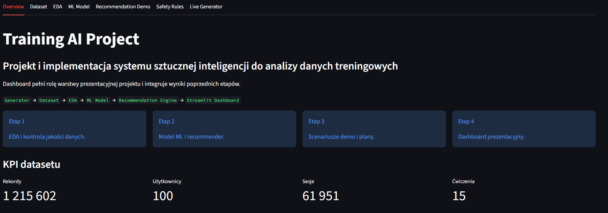

Zrzut ekranu pokazuje główny pipeline projektu oraz podstawowe KPI datasetu, dlatego dobrze pełni funkcję wizualnego wprowadzenia do dashboardu.

## 10.4. Zakładka Dataset

Zakładka Dataset prezentuje dane wejściowe projektu. Pokazuje statystyki globalne, takie jak liczba użytkowników, sesji, ćwiczeń, poziomów, splitów i faz. Zawiera także zakres dat oraz podgląd pierwszych rekordów i typów kolumn.

Ważną funkcją tej zakładki jest analiza wybranego użytkownika. Dashboard umożliwia filtrowanie po `level`, `sex` i `user_id`. Dla wybranej grupy pokazuje liczbę rekordów, użytkowników, sesji, ćwiczeń, średni i maksymalny ciężar. Dla konkretnego użytkownika prezentuje liczbę rekordów, sesji, ćwiczeń, średni RIR, średnie `fatigue` oraz sumę `volume`.

Zakładka pozwala również porównać użytkownika z całym datasetem, zobaczyć top ćwiczeń, trend miesięcznego `volume` oraz ranking siłowy użytkowników w wybranej grupie. Jest to szczególnie przydatne do pokazania, że użytkownicy `advanced male` mogą istotnie różnić się realnymi wynikami siłowymi.

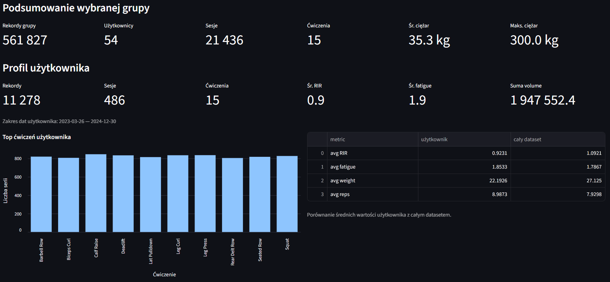

Zrzut ekranu pokazuje podsumowanie grupy `advanced male` oraz profil wybranego użytkownika, co wspiera wniosek o dużym zróżnicowaniu użytkowników w tej samej kategorii `level`.

## 10.5. Zakładka EDA

Zakładka EDA pokazuje najważniejsze wyniki eksploracyjnej analizy danych w formie prostych wykresów. Obejmuje rozkład `level`, rozkład `split`, rozkład `phase`, top 10 ćwiczeń oraz miesięczny trend całkowitej objętości treningowej.

Trend objętości jest liczony jako suma `reps * weight` w ujęciu miesięcznym. Dzięki temu zakładka pozwala szybko przejść od struktury datasetu do interpretacji zachowania treningowego w czasie.

## 10.6. Zakładka ML Model

Zakładka ML Model pokazuje, czy lokalnie dostępny jest model `models/best_weight_prediction_model.joblib`. Jeżeli modelu nie ma, dashboard informuje, że można go wygenerować przez uruchomienie Etapu 2 albo pobrać osobno, jeśli zostanie udostępniony.

Zakładka wczytuje metryki z `app/demo_assets/model_comparison_results.csv` albo z `outputs/stage2_outputs/model_comparison_results.csv`, jeżeli takie pliki są dostępne lokalnie. Pokazuje najlepszy MAE, RMSE, R², odsetek predykcji w zakresie 5 kg, wykres porównania modeli według MAE oraz wykres trafień within 5 kg. W expanderze dostępna jest pełna tabela porównania modeli.

Jeżeli lokalnie istnieją pliki ewaluacji grupowej, dashboard pokazuje także wyniki według `level`, `phase`, `sex` i `exercise`.

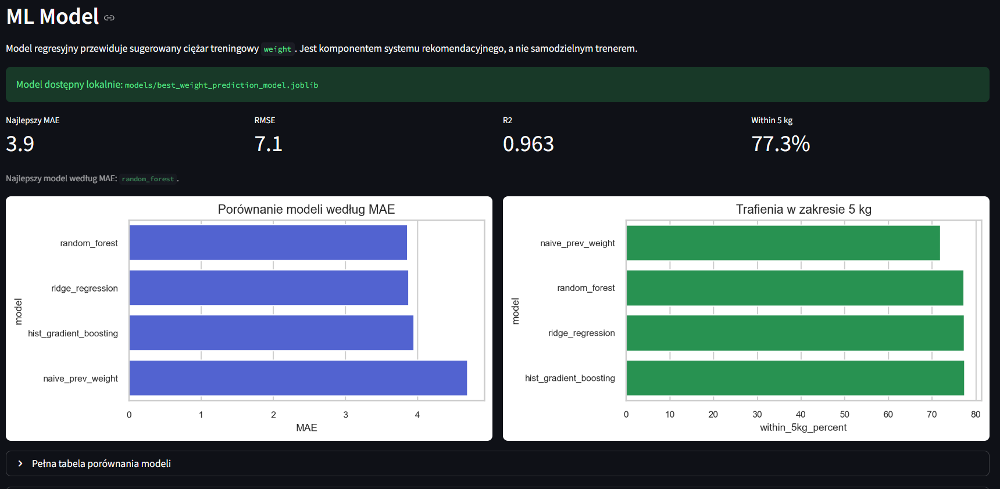

Zrzut ekranu pokazuje dostępność modelu lokalnego, najważniejsze metryki oraz porównanie modeli według MAE i trafień w zakresie 5 kg.

## 10.7. Zakładka Recommendation Demo

Zakładka Recommendation Demo korzysta z plików w `app/demo_assets/`. Wczytuje `scenario_comparison.csv` oraz plany `plan_*.csv`. Użytkownik może wybrać scenariusz demonstracyjny i zobaczyć KPI planu: liczbę dni, liczbę pozycji planu, liczbę unikalnych ćwiczeń, średni sugerowany ciężar, średni RIR, liczbę pozycji z historią oraz liczbę korekt bezpieczeństwa.

Plan jest prezentowany jako lista dni treningowych, np. Day 1 - Push, Day 2 - Pull i Day 3 - Legs. Dodatkowo dashboard udostępnia uproszczoną tabelę planu oraz pełną tabelę techniczną w expanderze. Dzięki temu można pokazać zarówno czytelny widok dla użytkownika, jak i szczegóły implementacyjne.

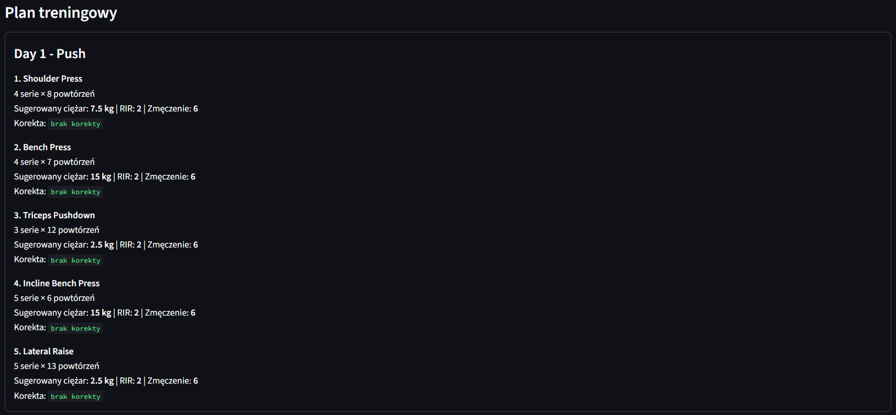

Zrzut ekranu pokazuje plan jako listę ćwiczeń w dniu treningowym, czyli najbardziej czytelną formę prezentacji rezultatu rekomendera.

## 10.8. Zakładka Safety Rules

Zakładka Safety Rules pokazuje, jak reguły bezpieczeństwa wpływają na plany demonstracyjne. Użytkownik wybiera scenariusz, a dashboard prezentuje rozkład wartości `safety_adjustment` oraz tabelę ćwiczeń, dla których zastosowano korekty.

Zakładka tłumaczy znaczenie typów korekt, takich jak `no_adjustment`, `limited_by_progression_cap`, `limited_by_high_fatigue_or_low_rir`, `deload_reduction` oraz `age_adjusted_progression_cap`. Dzięki temu odbiorca może zobaczyć, że finalny ciężar nie jest ślepą predykcją modelu, lecz wynikiem dodatkowej kontroli.

## 10.9. Zakładka Live Generator

Zakładka Live Generator umożliwia wygenerowanie planu na żywo, ale tylko wtedy, gdy lokalnie dostępny jest model `.joblib` oraz dataset. Jeśli model nie istnieje, dashboard nadal działa w trybie prezentacyjnym na podstawie `app/demo_assets/`, ale generowanie live jest niedostępne.

Live Generator obsługuje dwa tryby:

* użytkownik z historią danych,
* nowy użytkownik z kalibracją siłową.

W trybie użytkownika z historią wybierany jest `user_id` z datasetu, a system może wykorzystać wcześniejsze treningi tej osoby. W trybie nowego użytkownika formularz wymaga kalibracji siłowej, ponieważ sam wiek, płeć i poziom zaawansowania nie wystarczają do wiarygodnego przewidywania absolutnych obciążeń.

Formularz profilu obejmuje wiek, płeć, poziom, fazę treningową i liczbę dni treningowych. Formularz kalibracji pozwala podać ciężary robocze dla głównych ćwiczeń. Po wygenerowaniu planu dashboard pokazuje rekomendowany split, KPI planu, listę dni treningowych, uproszczoną tabelę, pełną tabelę techniczną oraz przycisk pobrania planu jako CSV.

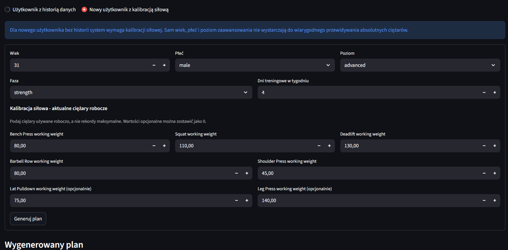

Zrzut ekranu pokazuje tryb nowego użytkownika z kalibracją siłową oraz początek wygenerowanego planu, dlatego dobrze ilustruje obsługę problemu cold start.

Najważniejsze elementy implementacji znajdują się w `app/streamlit_app.py`. Aplikacja najpierw sprawdza obecność lokalnego modelu, a następnie ładuje go przez `joblib`.

```python
MODEL_PATH = BASE_DIR / "models" / "best_weight_prediction_model.joblib"
DEMO_ASSETS_DIR = BASE_DIR / "app" / "demo_assets"

@st.cache_resource
def load_local_model() -> Any | None:
    if not MODEL_PATH.exists():
        return None
    return joblib.load(MODEL_PATH)
```

Live Generator rozdziela dwa scenariusze użycia: użytkownika z historią danych oraz nowego użytkownika z kalibracją siłową.

```python
generator_mode = st.radio(
    "Tryb generowania",
    [
        "Użytkownik z historią danych",
        "Nowy użytkownik z kalibracją siłową",
    ],
    horizontal=True,
)

with st.form("live_generator_form"):
    # ... pominięto mniej istotny fragment formularza ...
    strength_calibration = render_strength_calibration_inputs(level)
    submitted = st.form_submit_button("Generuj plan")

plan_df, metadata = generate_training_plan(
    profile=profile,
    model=model,
    data=add_exercise_categories(dataset_df),
    user_id=user_id,
    strength_calibration=strength_calibration,
)

st.download_button(
    "Pobierz plan CSV",
    data=plan_df.to_csv(index=False).encode("utf-8"),
    file_name="live_training_plan.csv",
    mime="text/csv",
)
```

Kod pokazuje, że dashboard jest warstwą prezentacyjną nad przygotowaną wcześniej logiką rekomendacyjną, a nie osobnym miejscem trenowania modelu.

## 10.10. Wnioski z dashboardu

Dashboard integruje całą pracę w jednym widoku demonstracyjnym. Pozwala pokazać dataset, EDA, modelowanie, scenariusze rekomendacyjne, reguły bezpieczeństwa oraz działający generator planów. Dzięki temu projekt jest prezentowany nie tylko jako zestaw skryptów, ale jako spójny system AI wspierający analizę danych treningowych.

Jednocześnie dashboard pozostaje demonstratorem, a nie aplikacją produkcyjną. Jego celem jest prezentacja logiki systemu, wyników i ograniczeń, a nie obsługa rzeczywistych użytkowników w środowisku produkcyjnym.

# 11. Ograniczenia projektu

Projekt ma charakter demonstracyjny i edukacyjny, dlatego jego ograniczenia należy rozpatrywać na kilku poziomach: danych, generatora, modelu regresyjnego, systemu rekomendacyjnego oraz dashboardu. Ograniczenia te nie przekreślają wartości projektu, ale wskazują, jak należy interpretować uzyskane wyniki i w jakich obszarach system wymaga dalszej walidacji.

## 11.1. Syntetyczny charakter danych

Dane wykorzystane w projekcie nie pochodzą od rzeczywistych użytkowników. Są efektem działania generatora przygotowanego w repozytorium. Dzięki temu możliwe było stworzenie kompletnego datasetu, przeprowadzenie EDA, zbudowanie cech historycznych, wytrenowanie modeli oraz przygotowanie demonstratora systemu.

Syntetyczny charakter danych dobrze sprawdza się w projekcie pokazującym pełny proces data science, ponieważ pozwala kontrolować strukturę zbioru i uniknąć problemów prywatności. Jednocześnie taki dataset nie może być traktowany jako pełny opis rzeczywistych zachowań treningowych. Wyniki analizy i modelowania pokazują działanie systemu w kontrolowanych warunkach, ale nie stanowią dowodu skuteczności na realnych danych treningowych.

## 11.2. Ograniczenia generatora

Generator upraszcza rzeczywistość treningową. Symuluje użytkowników, fazy treningowe, progresję, zmęczenie i parametry serii, ale nie jest w stanie odtworzyć wszystkich czynników wpływających na prawdziwy trening. W praktyce na wyniki użytkownika wpływają także technika, sen, stres, dieta, kontuzje, motywacja, jakość sprzętu, przerwy między seriami i wiele innych czynników.

Realizm danych zależy od przyjętych założeń generatora. Zmienne takie jak `level`, `fatigue`, `rir`, progresja oraz fazy treningowe są symulowane. Oznacza to, że część relacji może być bardziej regularna niż w danych rzeczywistych, a część zależności może być uproszczona. Model trenowany na takich danych uczy się wzorców obecnych w generatorze, a niekoniecznie wzorców występujących w realnych dziennikach treningowych.

## 11.3. Ograniczenia modelu regresyjnego

Model regresyjny przewiduje `weight`, ale nie zna wszystkich czynników wpływających na dobór ciężaru. Wykorzystuje dostępne cechy z datasetu, w tym informacje o ćwiczeniu, profilu użytkownika, parametrach serii i historii. Nie uwzględnia jednak pełnego kontekstu fizjologicznego i treningowego użytkownika.

Model uczy się wzorców z danych syntetycznych. Oznacza to, że dobry wynik na zbiorze testowym nie gwarantuje takiej samej jakości na danych rzeczywistych. Predykcja modelu nie powinna być traktowana jako gotowa porada treningowa. Jest to komponent wspierający system rekomendacyjny.

Ograniczeniem jest także interpretacja błędu w kilogramach. Ten sam błąd może mieć inne znaczenie dla ćwiczenia akcesoryjnego, takiego jak `Lateral Raise`, i inne dla ćwiczenia wielostawowego, takiego jak `Squat` lub `Deadlift`. Dlatego model wymaga kontekstu, historii użytkownika i reguł bezpieczeństwa.

## 11.4. Problem cold start

Problem cold start pojawia się wtedy, gdy użytkownik nie ma historii treningowej w systemie. Bez historii model traci najważniejszy punkt odniesienia, czyli wcześniejsze ciężary użytkownika w konkretnych ćwiczeniach. W takim przypadku rekomendowanie absolutnego obciążenia jest znacznie trudniejsze.

Sam wiek, płeć i poziom zaawansowania nie wystarczają do wiarygodnego określenia ciężaru roboczego. Dwie osoby o tym samym `level` mogą różnić się realną siłą bardzo znacząco. Z tego powodu w dashboardzie dodano tryb nowego użytkownika z kalibracją siłową, w którym użytkownik podaje aktualne ciężary robocze dla głównych ćwiczeń.

## 11.5. Ograniczenia zmiennej `level`

Zmienna `level` jest ogólną kategorią opisującą poziom zaawansowania, ale nie zastępuje informacji o realnej sile użytkownika. Nie mówi bezpośrednio, ile dana osoba jest w stanie wykonać w `Bench Press`, `Squat` czy `Deadlift`.

EDA potwierdziła duży rozrzut wyników nawet w tej samej grupie. Użytkownicy `advanced` mogą mieć bardzo różne ciężary robocze w tych samych ćwiczeniach. Oznacza to, że `level` może pomagać w doborze ogólnej struktury planu, ale nie powinien być jedyną podstawą do rekomendacji absolutnego ciężaru.

## 11.6. Brak walidacji eksperckiej

Plany generowane przez system nie zostały zweryfikowane przez trenera personalnego ani specjalistę przygotowania motorycznego. Projekt nie ma charakteru medycznego i nie powinien być traktowany jako narzędzie do diagnozy, rehabilitacji ani planowania treningu osób z przeciwwskazaniami zdrowotnymi.

Rekomendacje należy interpretować jako demonstrację działania systemu AI. Przed realnym użyciem potrzebna byłaby walidacja ekspercka: ocena doboru ćwiczeń, objętości, intensywności, progresji i reguł bezpieczeństwa przez osobę posiadającą kompetencje trenerskie.

## 11.7. Ograniczenia dashboardu

Dashboard Streamlit jest demonstratorem, a nie aplikacją produkcyjną. Nie zawiera logowania użytkowników, bazy danych, zapisu historii wygenerowanych planów ani produkcyjnego API. Działa głównie lokalnie i korzysta z plików CSV oraz lokalnego modelu `.joblib`, jeżeli jest dostępny.

Jego celem jest pokazanie procesu i wyniku projektu: danych, EDA, modelowania, rekomendacji, reguł bezpieczeństwa i Live Generatora. Nie jest to gotowy produkt SaaS ani aplikacja przygotowana do obsługi rzeczywistych użytkowników.

# 12. Możliwości rozwoju

Projekt można rozwijać w kilku kierunkach. Najważniejsze z nich dotyczą zastąpienia lub uzupełnienia danych syntetycznych danymi rzeczywistymi, rozbudowy cech użytkownika, lepszej personalizacji modelu, rozwoju rekomendera, walidacji eksperckiej oraz dopracowania dashboardu.

## 12.1. Użycie danych rzeczywistych

Najważniejszym kierunkiem rozwoju byłoby użycie realnych dzienników treningowych. Dane rzeczywiste pozwoliłyby sprawdzić, na ile założenia generatora odpowiadają praktyce oraz jak model zachowuje się poza środowiskiem syntetycznym.

Taki zbiór umożliwiłby ocenę jakości rekomendacji w praktyce, porównanie predykcji z decyzjami trenerów lub użytkowników oraz wykrycie zależności, których generator nie uwzględnia. Dane rzeczywiste byłyby również podstawą do dalszej walidacji modelu i reguł bezpieczeństwa.

## 12.2. Dodanie nowych cech użytkownika

System mógłby zostać rozbudowany o dodatkowe cechy użytkownika, które lepiej opisują kontekst treningowy. Szczególnie przydatne byłyby:

* masa ciała,
* wzrost,
* dokładny staż treningowy,
* aktualne ciężary robocze,
* wyniki 1RM lub e1RM,
* historia kontuzji,
* cel treningowy,
* dostępny sprzęt,
* preferencje ćwiczeń,
* informacje o śnie i regeneracji.

Takie cechy pozwoliłyby lepiej odróżniać użytkowników o podobnym `level`, ale różnym realnym poziomie siły, możliwościach regeneracyjnych i ograniczeniach treningowych.

## 12.3. Rozbudowa modelu personalizacji

Kolejnym kierunkiem jest rozbudowa modelu personalizacji. Dane treningowe mają charakter sekwencyjny, dlatego można rozważyć modele lepiej opisujące przebieg zmian w czasie. Możliwe byłoby także przygotowanie osobnych modeli dla ćwiczeń lub grup ćwiczeń, ponieważ błąd predykcji ma inne znaczenie dla ćwiczeń akcesoryjnych i wielostawowych.

Warto rozważyć również modele rekomendacyjne typu użytkownik-ćwiczenie, które uczyłyby się preferencji i skuteczności ćwiczeń dla konkretnych profili. Dalszy rozwój mógłby obejmować ocenę jakości rekomendacji per użytkownik, personalizację tempa progresji oraz wykrywanie sytuacji, w których model działa słabiej dla określonych grup.

## 12.4. Rozbudowa systemu rekomendacyjnego

System rekomendacyjny można rozbudować o bardziej zaawansowany dobór ćwiczeń. Obecna logika wykorzystuje kategorie ruchu i dane podobnych użytkowników, ale w przyszłości mogłaby uwzględniać preferencje użytkownika, ograniczenia sprzętowe, przeciwwskazania, priorytety mięśniowe oraz warianty ćwiczeń.

Rozwój rekomendera mógłby obejmować generowanie kilku wariantów planu, długoterminową periodyzację oraz autoregulację na podstawie RIR i fatigue. System mógłby modyfikować kolejne tygodnie planu na podstawie wykonania poprzednich jednostek treningowych, a nie tylko generować pojedynczy plan tygodniowy.

## 12.5. Walidacja ekspercka

Ważnym etapem dalszego rozwoju byłaby konsultacja z trenerem personalnym. Ekspert mógłby ocenić wygenerowane plany, dobór ćwiczeń, objętość, intensywność, progresję oraz zastosowane reguły bezpieczeństwa.

Walidacja mogłaby obejmować testy scenariuszowe dla różnych profili użytkowników, porównanie planów z planami przygotowanymi ręcznie oraz korektę reguł bezpieczeństwa na podstawie wiedzy trenerskiej. Dzięki temu system mógłby stać się bardziej wiarygodny i praktyczny.

## 12.6. Rozbudowa dashboardu

Dashboard można rozbudować funkcjonalnie i wizualnie. Najważniejsze kierunki to zapis profili użytkowników, historia wygenerowanych planów, eksport planu do PDF, lepsze porównanie scenariuszy oraz możliwość uploadu własnych danych treningowych.

Kolejnym krokiem mógłby być deployment aplikacji oraz poprawki UI/UX, takie jak bardziej rozbudowane formularze, lepsze komunikaty walidacyjne, widok historii progresji użytkownika i czytelniejsza prezentacja reguł bezpieczeństwa. Wersja produkcyjna wymagałaby także bazy danych, autoryzacji i stabilnego API.

# 13. Podsumowanie i wnioski końcowe

Projekt obejmował przygotowanie kompletnego demonstratora systemu AI do analizy danych treningowych i generowania planów. Zrealizowano pełny przepływ od danych, przez modelowanie, aż po rekomendację i dashboard prezentacyjny.

## 13.1. Podsumowanie wykonanych prac

W projekcie wykonano kilka powiązanych etapów:

1. Przygotowano generator syntetycznych danych treningowych, który tworzy dane na poziomie pojedynczej serii.
2. Wygenerowano kanoniczny dataset `data/FINAL_ENGINE_V4.csv`.
3. Przeprowadzono eksploracyjną analizę danych, obejmującą strukturę zbioru, rozkłady zmiennych, ćwiczenia, objętość i użytkowników.
4. Przygotowano dane do modelowania, w tym cechy historyczne i czasowy podział train/test.
5. Porównano modele regresyjne przewidujące `weight`.
6. Zbudowano hybrydowy system rekomendacyjny łączący model ML, historię użytkownika, dane podobnych użytkowników i reguły bezpieczeństwa.
7. Przygotowano demonstrator Etapu 3 generujący plany dla kilku scenariuszy.
8. Zbudowano dashboard Streamlit integrujący wyniki projektu oraz Live Generator.

## 13.2. Najważniejsze wyniki

Dataset zawiera 1 215 602 rekordy, 100 użytkowników, 61 951 sesji treningowych i 15 ćwiczeń. Zakres danych obejmuje okres od 2022-01-01 do 2024-12-30. Zbiór pozwolił przeprowadzić EDA, przygotować cechy historyczne i wytrenować modele regresyjne.

Najlepszy wynik według głównej metryki MAE uzyskał Random Forest. Model osiągnął MAE około 3.86 kg i poprawił wynik względem baseline `naive_prev_weight`. Różnica względem Ridge Regression była niewielka, dlatego wybór modelu finalnego należy rozumieć jako decyzję opartą na przyjętym kryterium MAE.

Demonstrator Etapu 3 potwierdził, że system może generować plany dla różnych profili użytkowników, a dashboard Streamlit zintegrował wyniki projektu w jednym miejscu. Live Generator obsługuje zarówno użytkownika z historią, jak i nowego użytkownika z kalibracją siłową.

## 13.3. Wnioski metodologiczne

Najważniejszy wniosek metodologiczny jest taki, że sama predykcja modelu to za mało. Model ML może przewidywać sugerowany ciężar, ale finalna rekomendacja treningowa wymaga kontekstu użytkownika, historii, reguł bezpieczeństwa i interpretacji.

Historia użytkownika jest szczególnie ważna, ponieważ poprzednie ciężary w tym samym ćwiczeniu stanowią najlepszy punkt odniesienia dla kolejnych rekomendacji. Zmienna `level` nie zastępuje realnej informacji o sile użytkownika. Problem cold start wymaga kalibracji siłowej albo bardzo ostrożnego traktowania rekomendacji.

Podejście hybrydowe okazało się bardziej praktyczne niż sam model ML. System łączy predykcję, dane podobnych użytkowników, historię, kalibrację i reguły bezpieczeństwa. Jest to szczególnie istotne w obszarze treningu siłowego, gdzie błędna rekomendacja może prowadzić do zbyt agresywnej progresji.

## 13.4. Wniosek końcowy

Projekt spełnił cel jako demonstracyjny system AI do analizy danych treningowych i generowania planów. Pokazuje pełny proces data science: przygotowanie danych, eksplorację, modelowanie, rekomendację, demonstrator oraz dashboard. System wymaga dalszej walidacji przed użyciem praktycznym, zwłaszcza na danych rzeczywistych i z udziałem ekspertów treningowych. Stanowi jednak dobrą bazę do dalszego rozwoju w kierunku bardziej zaawansowanej personalizacji treningu.

# Bibliografia

1. scikit-learn developers, *scikit-learn User Guide*, https://scikit-learn.org/stable/user_guide.html.
2. scikit-learn developers, *Regression metrics*, https://scikit-learn.org/stable/modules/model_evaluation.html#regression-metrics.
3. scikit-learn developers, *RandomForestRegressor documentation*, https://scikit-learn.org/stable/modules/generated/sklearn.ensemble.RandomForestRegressor.html.
4. Streamlit, *Streamlit documentation*, https://docs.streamlit.io/.
5. pandas development team, *pandas documentation*, https://pandas.pydata.org/docs/.
6. Breiman, L. (2001). Random Forests. *Machine Learning*, 45, 5-32.
7. Ricci, F., Rokach, L., Shapira, B. (red.). (2011). *Recommender Systems Handbook*. Springer.
8. Helms, E. R., Cronin, J., Storey, A., Zourdos, M. C. (2016). Application of the Repetitions in Reserve-Based Rating of Perceived Exertion Scale for Resistance Training. *Strength and Conditioning Journal*, 38(4), 42-49.
9. American College of Sports Medicine. (2009). Progression Models in Resistance Training for Healthy Adults. *Medicine & Science in Sports & Exercise*, 41(3), 687-708.
